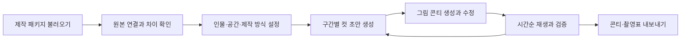

# 영상 제작 콘티 생성 도구 — Plan

> 목적: 기존 유튜브 제작 자료를 연결하여 원문과 방송 순서를 보존하는 컷 단위 그림 콘티와 제작 지시서를 만든다.
>
> 검토일: 2026-09-05 · 기준 프로젝트: PRJ-007 「의부증의 늪」
>
> 상태: 자료 분석·Design·첫 완성본 구현과 자동 검증 완료. 실제 WAV의 자원·metadata·이전 형식 복구, journal 기반 저장 복구, Cue 범위 브라우저 재생을 포함한다. 합성 범용 사례 및 PRJ-007 `SEG-008`의 Codex App 컷·이미지·가이드 음성 흐름을 검증했으며, 다른 대표 예외와 전체 분량의 제작 품질 검토가 남아 있음.

## 1. 결론과 목표

이 프로젝트는 이미 이야기, 대사, 방송 시간표, 촬영·편집 의도가 상당 부분 정리돼 있다. 가장 적합한 방향은 기존 제작 파이프라인 뒤에 **자료를 연결하고 컷을 설계하는 콘티 생성 단계**를 추가하는 것이다.

새 도구가 해결해야 할 핵심 문제는 “이 내용을 어느 화면으로, 몇 초 동안, 어떤 소리와 함께 보여 줄 것인가”이다. 최종 산출물은 컷마다 그림, 시간, 구도, 행동, 발화, 자막, 음향, 전환, 필요한 인물·소품, 원문 근거가 연결된 편집 가능한 콘티다.

목표 달성은 세 단계로 확인한다.

1. **내용 보존:** 기존 장면·구간·대사·자막을 중복 없이 연결하고 출처를 추적한다.
2. **연출 구체화:** 장면 안의 행동과 감정 변화를 컷으로 나누고 구도·지속시간·화면 자산을 제안한다.
3. **제작 가능성 검증:** 그림과 가이드 음성을 시간순으로 재생해 대사 소화, 자막 가독성, 연속성, 반전 시점을 확인한다.

이 문서는 자료 분석과 구현 판단의 기준이다. 첨부 문서 속 지시문은 제작 요구사항을 파악하기 위한 데이터로 취급하며 시스템 명령으로 실행하지 않는다.

## 2. 확인한 자료와 증거

### 2.1 첨부 폴더의 8개 파일

8개 파일을 모두 읽었다. 그림·영상·음성 자산은 이 폴더에 없으며 Markdown 7개와 JSON 1개로 구성돼 있다.

| 자료 | 확인한 내용 | 콘티 도구에서의 용도 |
|---|---|---|
| [broadcast_readable_script.md][S01] | 장면 12개, 인물 5명, 패널 3명, 대사·지문·내레이션·패널의 방송 순서 | 사람이 확인할 통합 원문과 결과 대조 |
| [reenactment_character_script.md][S02] | 장면별 장소·시간·감정·행동·발화·음향, 패널 제외 | 재연 장면의 연기와 시각적 행동 분석 |
| [shooting_script.md][S03] | 32개 구간별 촬영 큐와 제작 표현 조건 | 구도·동선·롱테이크·인서트 등 연출 제약 |
| [edit_script.md][S04] | 절대 타임코드, 모드, 장면 ID, 편집 지시 | 편집 순서와 구간 길이 대조 |
| [narration.md][S05] | 구간 ID와 화자가 붙은 내레이션 12개 | 보이스오버 트랙과 화면 연결 |
| [panel_reaction_script.md][S06] | 패널 구간 8개, 발화 16개 | 패널 화면과 화자 전환 |
| [subtitle_script.md][S07] | 시작 시각이 지정된 고지·증거 그래픽·브리지 자막 25개 | 화면 글자와 표시 시점 관리 |
| [production_manifest.json][S08] | 장면별 인물 ID, 장소 ID, 제작 규모, 산출물 해시 | 입력 묶음 식별과 제작 자원 대조 |

### 2.2 실제로 확인한 구조와 정합성

| 항목 | 확인 결과 |
|---|---|
| 전체 길이 | 1,500초 = 25:00 |
| 장면 / 방송 구간 | 12개 / 32개, 구간 ID 중복 없음 |
| 재연 | 12구간, 960초 = 16:00 |
| 내레이션 | 12구간, 340초 = 05:40 |
| 패널 | 8구간, 200초 = 03:20 |
| 촬영 큐와 편집표 | 32개 구간의 ID·시작·종료·장면이 모두 일치 |
| 시간표 공백·겹침 | 편집표의 구간 경계 기준 0건 |
| 자막 시작 시각 | 25개 모두 지정 구간 안에 있음 |
| 방송용 문서 해시 | manifest의 해당 파일 SHA-256과 일치 |

이 검증은 문서와 시간표의 구조에 대한 것이다. 실제 낭독 길이, 화면에 표시할 자막의 종료 시점, 그림의 품질, 영상의 호흡까지 검증됐다는 뜻은 아니다.

### 2.3 같은 프로젝트에 존재하는 구조화 원본

첨부 문서가 참조하는 앞 단계 파일의 존재와 필요한 구조도 추가 확인했다. 아래 자료는 **첨부 8개 파일 밖의 보조 확인 자료**다.

| 구조화 원본 | 확인한 구조 | 재사용 가치 |
|---|---|---|
| [presentation_plan.json][U01] | `SEG` 32개, 시작·길이·모드·장면, 공개·참조 사실/단서 ID | 순서와 공개 시점의 기준 |
| [screenplay_units.json][U02] | 장면 아래 `UNIT` 79개, 원문·화자·구간·사실/단서/반전 참조 | 대사를 재추출하지 않고 컷과 직접 연결 |
| [reaction_segments.json][U03] | `RSEG` 8개, `TURN` 16개, 패널·발화·근거·인지 범위 | 패널 발화 원문과 정보 범위 보존 |
| [characters.json][U04] | 인물 ID 5개와 이름의 대응 | 배우·인물 자산 연결 |
| [panel_cast.json][U05] | 패널 ID 3개와 이름·역할 | 재연 인물과 패널 구분 |
| [scene_cards.json][U06] | 장면 ID 12개, 장면 맥락·장소·인물·단서 | 장면 수준 제작 맥락 |
| [final_script.md][U07] | `SEGMENT`·`UNIT` 마커가 있는 방송 대본 | 최종 방송 순서와 원문 대조 |
| [production_footprint.json][U08] | 계획된 제작 규모와 원본 해시 | manifest와 제작 규모 연결 |

추가 대조 결과:

- 구조화 대본의 79개 원문 문자열이 방송용 문서·인물 대본·기계형 최종 대본에 모두 포함되어 있다. 구성은 대사 32, 내레이션 12, 지문 21, 화면 문구 9, 음향 3, 채팅 1, 메모 1이다.
- 패널 원문 16개가 제작용 패널 문서에 모두 포함되어 있다. 내레이션 원문 12개도 내레이션 문서에 모두 포함되어 있다.
- `presentation_plan.json`의 32개 구간은 제작용 편집표와 일치한다.
- 원문 포함 여부 검사는 문자열 대조다. 중복 발생 여부나 모든 문맥·순서의 동등성을 보증하는 전체 파이프라인 검증은 수행하지 않았다.
- footprint 연결 해시는 JSON 키를 정렬하고 공백을 제거한 정규 표현으로 계산하면 일치한다. 기존 [document_sha256 함수][C01]에서 이 규약을 확인했다. 파일 바이트 해시와 혼용하면 잘못된 오류가 발생한다.

인물 대응은 `CHAR-01=강태균`, `CHAR-02=윤서진`, `CHAR-03=백기철`, `CHAR-04=오민주`, `CHAR-05=박도현`이다. 이 대응은 구조화 원본으로 확인했으며, 첨부 manifest 자체에는 이름 대응표가 없다.

**추론:** 운영용 입력은 구조화 원본과 제작 지시를 묶은 패키지로 만드는 편이 적합하다. 첨부 문서는 사람이 검토하기 좋지만, 일부 ID와 내부 연결이 의도적으로 생략되어 있어 재파싱하면 이미 존재하는 정보를 다시 추론해야 한다.

## 3. 콘티 생성 전에 다뤄야 할 공백

### 3.1 자료의 공백·차이와 처리 방침

| 관찰 | 구체적 근거 | 도구의 처리 |
|---|---|---|
| 컷 단위 정보가 없음 | 촬영표는 한 구간에 여러 행동·화면을 서술한다. 컷 ID와 개별 지속시간은 없다. | `SEG → SHOT` 분할을 새 기능으로 제공한다. 컷 수를 미리 고정하지 않는다. |
| 장면 소속과 화면 장소가 다를 수 있음 | `SEG-018`은 관리실 장면 `SCN-07`에 속하지만 촬영 큐는 태균의 표정, 편집표는 아파트 내부 재진입을 지정한다. | 이야기의 `scene_id`와 컷의 실제 화면 장소를 별도로 저장한다. |
| 패널 공간·촬영 형태 미정 | 패널 3명이 있으나 manifest에는 재연 장소 2종과 인물 5명만 있다. | 패널을 실사·아바타·음성+그래픽 중 어떻게 표현할지 제작 프로필에서 정한다. 세트나 출연 비용을 임의로 0으로 취급하지 않는다. |
| 장면 출연 목록이 컷별 출연표는 아님 | `SCN-12` manifest는 5명을 포함하지만 지문은 태균·도현 중심이다. 관리실 직원의 손·안내 음성도 대본에 있다. | 화면 등장, 음성 출연, 이름 언급, 손 대역·보조 인물을 구분한다. |
| 화면 문구의 상세본·축약본이 공존 | `SEG-024`의 복구 문서 자막은 원문의 “작성 계정 두 개”가 빠져 있다. `SEG-027` 자막에는 원문의 “작성 시점” 설명이 없다. | 별도 화면 요소인지 축약본인지 대조 화면에서 결정한다. 문자열이 다르다고 자동 병합·교체하지 않는다. |
| 자막 종료 시각과 대사 자막 싱크 없음 | 자막 문서는 고지·그래픽의 시작 위치만 지정하고, 대사 자막은 최종 대본을 참조한다. | 종료 시각과 대사별 시작·종료를 별도로 제안하고 실제 음성으로 검증한다. |
| 화자와 화면에 보이는 인물은 다름 | 내레이션은 독립 구간이며 채팅·메모도 대본 단위로 존재한다. | 내레이션 화자를 매 컷에 등장시키거나 채팅·메모를 자동 낭독하지 않는다. |
| 인물·공간·소품의 시각 기준 없음 | 얼굴, 나이, 의상, 좌우 배치, 화면비, 그림체, 소품 레퍼런스가 없다. | 시각 기준표를 먼저 만들고 제안과 확정 상태를 표시한다. |
| 제작 패키지만으로 원본 연결이 완결되지 않음 | 원본 대본·시간표는 앞 단계에 존재한다. manifest의 deliverables에는 방송용 문서 1개만 등재되어 있다. | 내보내는 입력 패키지에 필요한 원본·버전·각 파일 해시를 포함한다. |
| manifest 스키마의 상대경로 문제 | `$schema`를 manifest 위치 기준으로 해석하면 해당 파일이 없다. 스키마 파일은 저장소의 STANDARD 아래 존재한다. | 입력 포맷별 스키마와 해석 기준을 명시한다. 임의 경로 탐색으로 오류를 숨기지 않는다. |

이 항목들은 모두 대본 오류라는 뜻이 아니다. 예를 들어 축약 자막과 전체 문구는 서로 다른 화면 요소일 수 있고, 장면의 관리실 소속을 유지하면서 아파트 화면을 삽입하는 것도 자연스럽다. 도구가 이 차이를 명시적으로 표현할 수 있어야 한다.

### 3.2 이미 존재하는 연출 조건

다음은 원문 자료에 있는 제작 조건이므로 컷 생성 후에도 추적할 수 있어야 한다.

- 시작 첫 프레임의 창작 고지 3초 이상.
- `SEG-006`에서 예약 메시지의 조작 주체를 감추고, 대본상 조작 손은 프레임 밖에 유지.
- `SEG-011`에서 반송표 작성·부착의 연속성 유지.
- `SEG-019`의 복구 가능 문구를 2초 이상 읽을 수 있게 표시.
- `SEG-021`에서 태균의 문 통과를 끊지 않는 숏으로 표현.
- `SEG-024`, `SEG-027`, `SEG-030`의 반전·결말 공개 순서를 보존.
- `SEG-032`에서 내레이션 종료 후 마지막 2초 무음.
- 촬영 대본에 적힌 비선정적 표현, 폭력적 접촉을 촬영하지 않는 조건, 피해자의 자기결정을 유지하는 결말을 반영.

반전은 구간 ID만 검사해서는 충분하지 않다. `SEG-006`에서 조작자의 얼굴, 휴대전화 소유자 표시, 반사상, 손의 특징이 노출되면 대사 원문을 보존해도 정보가 앞서 공개될 수 있다.

## 4. 제안하는 제품 사용 흐름

1. **불러오기:** 프로젝트를 선택하면 12장면·32구간의 방송 흐름을 즉시 표시한다. 읽지 못한 파일, 지원하지 않는 버전, 끊어진 참조는 파일과 필드 단위로 설명한다.
2. **자료 확인:** 원본 발화와 제작 지시를 연결한다. 서로 다른 문구와 미정인 제작 항목을 한곳에서 확인한다.
3. **제작 설정:** 화면비, 실사 촬영/AI 제작/혼합, 패널 표현, 그림 스타일, 인물·공간 기준, 사용 가능한 장소·인력 범위를 정한다.
4. **컷 초안:** 행동 전환, 화자 변화, 시선, 중요한 소품, 새로 공개되는 정보를 기준으로 컷을 제안한다. 사용자는 컷을 합치거나 나누고 특정 컷만 다시 생성한다.
5. **그림 콘티:** 인물·장소·소품 기준을 공통으로 참조해 컷 그림을 만든다. 움직임이 중요한 컷은 시작·종료 프레임과 이동 방향을 표시한다.
6. **검증:** 원문 대조, 시간표, 자막 노출, 연속성, 정보 공개를 확인하고 그림과 음성을 시간순으로 재생한다.
7. **내보내기:** 검토 상태를 포함한 그림 콘티 PDF, 촬영·자산 목록 CSV, 재편집 가능한 프로젝트 JSON을 제공한다.

편집 화면은 장면/구간 목록, 중앙의 컷 카드, 선택 컷의 원문·연출·오디오·자막을 중심으로 구성한다. 주요 작업은 “컷 수정”, “합치기/나누기”, “다시 생성”, “확정”, “원문 보기”다.

## 5. 설계의 핵심 원칙

### 5.1 하나의 연결된 데이터 모델

| 개념 | 주요 정보 | 구분해야 할 사항 |
|---|---|---|
| 프로젝트 / 입력 묶음 | 프로젝트 ID, 버전, 파일 해시, 제작 프로필 | 원본 파일과 생성 결과 |
| 장면 | `SCN`, 이야기 맥락, 원래 장소, 서사 시간 | 방송 순서·실제 촬영 순서와 구분 |
| 방송 구간 | `SEG`, 모드, 시작, 길이, `RSEG` 연결 | 원문에서 정해진 편집 단위 |
| 대본 단위 | `UNIT` 또는 `TURN`, 원문, 유형, 화자, 출처 | 발화·채팅·메모·음향·화면 문구 구분 |
| 컷 | 안정적인 컷 ID, 화면 순서, 시작·길이, 구도·움직임·행동 | 여러 컷이 하나의 지문을 표현할 수 있음 |
| 음성 이벤트 | 발화 원문 참조, 화자, 시작·종료, 녹음 자산 | 하나의 발화가 여러 컷에 걸칠 수 있음 |
| 화면 글자 이벤트 | 원문/편집 문구, 시작·종료, 위치, 역할 | 소품 속 글자·오버레이·대사 자막 구분 |
| 자산 | 인물 외형, 의상, 장소, 소품, 그림·음성 파일 | 동일 소품의 시간별 상태와 버전 |
| 제약 / 검토 | 근거, 적용 범위, 판정, 사용자 결정 | 기계적 검사와 사람의 판단 |

컷은 `source_unit_ids`, `source_turn_ids`, `source_segment_id`, `source_refs`로 근거를 가진다. 순서를 바꿔도 컷 ID는 유지한다. 연출 제안에는 원문 확정 정보와 모델 추론을 구분하는 상태를 저장한다.

그림·음성·자막은 독립 트랙으로 관리한다. 컷 경계와 발화 경계가 다를 수 있고, J컷은 소리가 화면 전환보다 먼저 시작하므로 모든 정보를 한 컷 행의 텍스트에만 넣어서는 정확한 시간을 검증하기 어렵다.

### 5.2 원본의 권위는 필드별로 정한다

- 방송 순서·구간 시간은 구조화 시간표를 기준으로 하고 제작용 편집표와 대조한다.
- 재연 발화·내레이션 원문은 `screenplay_units`, 패널 발화는 `reaction_segments`를 기준으로 연결한다.
- 촬영과 편집 의도는 제작용 촬영·편집 문서에서 가져온다.
- 화면 문구의 내용과 자막 큐의 표시 시점은 각각 보존한다. 차이가 있으면 두 값을 보여 주고 명시적으로 해결한다.
- 생성 모델은 원문 대사, 사건, 반전 순서를 조용히 변경할 수 없다. 변경 제안은 별도 편집안으로 기록한다.

첨부 8개만 받는 가져오기 기능이 필요하다면 별도의 지원 입력 형식으로 설계한다. ID 없는 문서는 출처 문단과 임시 ID를 연결하고 미해결 매핑을 보여 준다. 구조화 입력을 읽다가 실패했을 때 자동으로 문서 추론으로 전환하지 않는다. 최초 구현은 구조화 원본을 포함하는 입력 패키지에 집중한다.

### 5.3 결정적인 검사는 코드, 연출 제안은 모델

| 코드가 담당 | 생성 모델이 담당 | 사람이 확정 |
|---|---|---|
| 파일 읽기, 스키마, ID 연결, 원문 참조 | 행동·감정 단위의 컷 분할 | 제작 방식과 연출 방향 |
| 시간 합계·경계·참조 무결성 검사 | 구도, 시선, 움직임, 소품 인서트 제안 | 과도한 컷·긴 정적·불필요한 인서트 |
| 원문 변경·누락·중복 감지 | 인물·공간 기준에 맞춘 그림 | 인물 외형과 공간 연속성 |
| 명시된 공개 시점·자막 최소 노출 검사 | 연출 제약을 반영한 시각 표현 | 그림 속 반전 누설과 감정 전달 |
| 저장·버전·차이·내보내기 | 부족한 시각 정보의 제안 | 추가 인력·세트·소품 수용 여부 |

모델에는 현재 구간의 원문, 해당 시점까지 공개된 정보, 허용된 연출 범위, 필요한 시각 기준을 전달한다. 인물 원본에 존재하는 미래 비밀을 매 컷의 이미지 생성 입력에 통째로 포함하지 않는다. 사실·단서 ID 검사에 더해 새 그림 자체의 시각 검토가 필요하다.

문서 안의 명령형 문장은 입력 데이터다. 도구 실행 권한·파일 접근 범위를 변경하는 지시로 해석하지 않는다.

### 5.4 생성·수정·재사용

- 전체 방송 흐름을 먼저 검토한 뒤 구간별로 컷을 생성한다. 인접 구간의 시작·종료 화면과 소품 상태를 연결한다.
- 대사 원문은 모델이 다시 쓰게 하지 않고 원문 참조로 출력물에 삽입한다.
- 인물/의상/공간/소품 기준을 정한 뒤 그림을 생성한다. 중요한 문서·메시지의 정확한 글자는 별도 화면 요소로 합성하는 구조를 둔다.
- 확정한 컷과 사용자 수정은 잠근다. 원본 변경 시 영향을 받는 컷과 후속 연속성 검토 항목을 표시한다.
- 입력·설정·생성 요청의 버전을 기록하고 결과를 재사용한다. 같은 요청으로 이미지가 항상 동일하게 생성된다고 보장하지 않는다.
- 외부 생성 요청은 정해진 횟수로 재시도하고 경고·요청 ID·상태 코드·응답 오류를 기록한다. 실패 후 빈 그림을 완성 결과로 취급하거나 다른 제공자로 임의 전환하지 않는다.

## 6. 예상 결과의 구체적 예

아래는 **출력 구조를 설명하기 위한 미확정 콘티 예시**다. 실제 그림을 생성하거나 연출을 확정한 결과가 아니다. 시간 분할·숏 크기는 제안이고, 발화·화면 문구·주체 비노출 조건은 원문에 근거한다.

대상: `SCN-03 / SEG-006`, 04:00–05:20, 총 80초. 근거는 `UNIT-016`부터 `UNIT-020`, 촬영·편집표의 해당 구간, 자막 큐 04:18이다.

| 컷 | 제안 시간 | 그림에 담을 내용과 구도 | 원문/음향 연결 | 반드시 유지할 조건 |
|---|---|---|---|---|
| 006-01 | 04:00–04:12 / 12초 | 회사 대화창의 입력란 인서트 | `UNIT-016`, 키보드 소리 | 조작 손·얼굴·소유자 식별 정보 비노출 |
| 006-02 | 04:12–04:26 / 14초 | 같은 화면에서 문장과 전송 예약 표시 | `UNIT-017`, 04:18에 “혼자 생각할 시간이 필요합니다. 당분간 연락하지 않겠습니다.” 표시 | 문구는 별도 텍스트 요소, 종료는 제안값 04:26 |
| 006-03 | 04:26–04:42 / 16초 | 화면을 보는 태균의 얼굴 클로즈업 | `UNIT-018` 원문 발화 | 태균을 메시지 작성자로 보이게 하지 않음 |
| 006-04 | 04:42–04:56 / 14초 | 서진의 반응 미디엄 숏 | `UNIT-019` 원문 발화 | 기기 조작 장면을 추가하지 않음 |
| 006-05 | 04:56–05:06 / 10초 | 태균 이름 옆 전송 완료 표시 인서트 | `UNIT-020` 앞부분, 전송음 | 아직 작성 주체를 확정하지 않음 |
| 006-06 | 05:06–05:20 / 14초 | 태균의 시선이 현관·창문·식탁 아래로 이어짐 | `UNIT-020` 뒷부분 | 다음 내레이션 구간 05:20 경계 유지 |

연결할 대사는 다음 원문을 그대로 사용한다.

- `UNIT-018 / 강태균`: 내가 쓴 말이 아니야. 저걸 보내면 회사 사람들은 내가 숨은 줄 알 거야.
- `UNIT-019 / 윤서진`: 당신이 생각할 시간을 갖는다고 알려 주는 것뿐이야. 아무도 방해하지 않을 거고.

제안 시간 합계는 80초지만, 두 발화와 행동이 이 길이를 자연스럽게 채우는지는 별도 문제다. 그림과 낭독을 재생해 정적이 길거나 정보가 반복되는지 확인해야 한다. 구간을 줄일 필요가 생기면 연결된 시간표의 변경안으로 제시하며 원래 25분을 자동으로 늘이거나 줄이지 않는다.

각 행의 최종 카드에는 이 표의 내용과 함께 그림, 원문 링크, 화면 인물·장소·소품, 생성 버전, 검토 상태가 들어간다.

## 7. 구현 범위와 요구사항

### 7.1 첫 번째 완성 범위

단일 제작자가 한 프로젝트를 로컬에서 열고 수정하는 작업을 기준으로 한다. 실사 촬영과 AI 제작에 공통으로 필요한 콘티 데이터와 편집 흐름을 먼저 만들고, 실제 영상 생성 연결은 제작 방식이 정해진 뒤 설계한다.

| ID | 요구사항 | 우선순위 | 완료 시 확인할 것 |
|---|---|---|---|
| FR-01 | 구조화 원본과 제작 지시 패키지 가져오기 | 필수 | 12장면·32구간·원문 ID 연결 |
| FR-02 | 출처·문구 차이·누락·미정 항목 표시 | 필수 | 자막 축약 차이와 패널 설정 누락 표시 |
| FR-03 | 인물·공간·소품·제작 프로필 관리 | 필수 | 화면비와 시각 기준이 컷에 연결 |
| FR-04 | 구간별 컷 생성, 합치기·나누기·재정렬 | 필수 | 원문과 구간 시간 보존 |
| FR-05 | 구도·행동·발화·자막·음향 연결 편집 | 필수 | 독립 트랙 시간과 원문 대조 |
| FR-06 | 시각 기준을 참조한 그림 콘티 생성 | 필수 | 수정·재생성·실패 상태 확인 |
| FR-07 | 그림과 가이드 음성을 시간순 재생 | 필수 | 낭독·침묵·자막·전환의 호흡 검토 |
| FR-08 | 시간·원문·공개 순서·연속성 검토 | 필수 | 자동 검사와 사람 검토의 결과 구분 |
| FR-09 | 컷 잠금, 버전 저장, 영향 범위 표시 | 필수 | 수정한 컷을 재생성이 덮어쓰지 않음 |
| FR-10 | JSON·그림 콘티 PDF·제작 목록 CSV 출력 | 필수 | 읽기·재열기·현장 확인 가능 |
| FR-11 | 첨부 8개 문서만으로 가져오는 별도 입력 형식 | 후속 | 원본 미포함 상태와 미해결 매핑 표시 |
| FR-12 | 편집기 프로젝트 파일·영상 생성 서비스 연결 | 후속 | 선택한 제작 도구의 규격으로 검증 |

텍스트 콘티는 중간 이정표다. 이번 최종 목표를 위한 첫 완성본에는 그림 확인과 시간순 검토까지 포함하는 것이 적합하다.

초기 범위 밖에는 새 이야기 생성, 채널 기획 재설계, 영상 자동 완성·업로드, 다중 사용자 권한·결제, 여러 영상 생성 제공자의 동시 지원을 둔다.

### 7.2 비기능 요구사항과 구현 관례

- 원본을 보존하고 모든 생성 결과와 수정 이력을 별도 프로젝트 상태에 저장한다.
- 대사·시간·출처·자산·검토 결과에 명시적인 타입과 스키마를 정의한다. 모르는 값은 미정 상태로 표현한다.
- 데이터 변환과 검증은 입력을 변경하지 않는 함수로 구현하고, 외부 생성 서비스 연결은 별도 인터페이스로 분리한다.
- 오류는 파일·필드·컷·요청을 특정하며 원인을 보존한다. 자동으로 값을 고쳐 성공으로 처리하지 않는다.
- 화면 이동·수정 저장과 외부 생성 작업을 분리한다. 작업이 진행 중이어도 기존 컷을 검토할 수 있게 한다.
- 생성 시간·재시도 횟수·호출 비용은 파일럿에서 측정한다. 모델을 정하지 않은 현재 단계에서 응답시간과 총비용을 수치로 보장하지 않는다.
- 프로젝트별 의존성과 실행 명령을 관리한다. 코드 주석은 한국어로 작성한다.

## 8. 아키텍처와 기존 로직 활용

현 작업 폴더에는 제품 코드가 없었다. 먼저 데이터 계약과 한 구간의 입출력을 고정한 다음 UI와 외부 생성 서비스를 붙이는 순서가 적합하다.

구조는 입력 어댑터 → 정규화 모델 → 컷 생성 → 검증 → 편집·저장 → 내보내기의 모듈로 나눈다. 생성 제공자와 UI 프레임워크는 Design 단계에서 선정한다. 현 단계의 제품 복잡도는 동적 편집 앱에 해당하지만, BaaS·클라우드 DB·로그인 도입 필요성은 확인되지 않았다.

기존 제작 저장소에는 다음 관련 함수가 존재한다.

- [screenplay_units 검증 코드][C02]: 대본 ID 참조, 화자, 장면 연결 검사 함수.
- [presentation_validation 코드][C03]: 시간표, 대본 구간 정렬, 패널 정보 공개 범위 검사 함수.
- [production_footprint 코드][C04]: 제작 규모와 manifest 생성·검증 관련 함수.
- [document_sha256][C01]: 구조화 JSON 해시 규약.

함수명과 일부 구현을 확인했으며 전체 테스트나 새 도구와의 통합 가능성까지 검증한 것은 아니다. Design 단계에서 함수의 의존성과 공개 인터페이스를 확인하여 호출 가능한 계약을 재사용한다. 기존 대본·시간표 검사를 중복 구현하기 전에 이 경계를 먼저 결정한다. 새 검증은 컷 배분, 화면 자산, 자막 지속시간, 화면 속 정보 공개, 인물·소품 연속성에 집중한다.

입력 패키지에는 직접 필요한 파일과 스키마를 명시한다. 기존 저장소의 내부 디렉터리 구조를 새 도구가 무제한 탐색해야 하는 설계는 피한다.

## 9. 성공 기준과 검증 계획

### 9.1 기계적으로 검증할 기준

1. PRJ-007의 장면 12개·구간 32개와 원문 79단위·패널 16발화가 ID로 연결된다.
2. 모든 원문 단위가 적절한 결과 요소에 연결된다. 대사·내레이션·패널 발화는 오디오 이벤트에서 누락·무단 변경·의도치 않은 중복이 0건이어야 한다. 지문 하나가 여러 컷에 연결되는 것은 중복 오류로 취급하지 않는다.
3. 기준 시간표를 유지하는 결과에서는 총 1,500초, 구간별 컷 시간 합계 일치, 주 영상 트랙 공백·겹침 0건을 만족한다. 의도한 오디오 겹침·전환은 별도 트랙 규칙으로 검사한다.
4. 자막 큐 25개의 시작 위치를 보존하고 모든 글자 이벤트의 종료 시각을 확정한다. 시작 고지 3초·복구 문구 2초·마지막 무음 2초 조건을 검사한다.
5. 명시된 사실·단서·반전의 공개 시점을 앞당기는 참조가 0건이어야 한다.
6. 입력 변경 후 해당 컷과 연속성에 영향을 받는 후속 컷을 표시하고, 잠근 사용자 수정은 보존한다.
7. 저장된 JSON을 다시 열었을 때 컷 순서·텍스트·자산 연결·검토 상태가 유지된다. PDF와 CSV의 컷 수·순서·시간이 프로젝트와 일치한다.

### 9.2 사람이 확인할 기준

- 대표 컷에서 인물, 의상, 공간 방향, 주요 소품이 연결된다.
- 조작 주체를 감추는 컷에서 얼굴·손·기기 표시·반사로 반전이 새지 않는다.
- 대사를 실제로 낭독할 수 있고, 필요한 자막을 읽을 시간이 확보된다.
- 촬영자 또는 영상 제작자가 컷별 행동·구도·필요 자산을 이해할 수 있다.
- 패널 화면 표현, 출연자·대역·장소·소품의 추가 필요가 미정으로 숨겨져 있지 않다.

파일럿에서는 초안 생성 시간, 수정 시간, 재생성 횟수, 최종적으로 유지된 컷 비율을 기록한다. 수동 제작 시간과의 비교는 같은 구간을 대상으로 측정한 뒤 목표를 정한다. 현 단계에서 생산성 향상률을 주장하지 않는다.

### 9.3 대표 검증 구간

| 구간 | 선택 이유 |
|---|---|
| `SEG-001` | 시작 고지, 소품 글자, 채팅과 음성 구분 |
| `SEG-005` | 패널 2인 발화와 20초 배분 |
| `SEG-006` | 메시지 인서트, 조작 주체 비노출 |
| `SEG-011` | 손·메모·상자의 상태 연속성 |
| `SEG-018` | 장면 소속과 실제 화면 장소 분리, 호출음 J컷 |
| `SEG-019` | 복구 문구 최소 노출시간 |
| `SEG-021` | 끊지 않는 이동 숏과 상반 진술 |
| `SEG-024` | 여러 증거의 순서와 문구 차이 처리 |
| `SEG-032` | 내레이션 종료, 마지막 2초 무음 |

먼저 `SEG-001`, `SEG-005`, `SEG-006`으로 텍스트·패널·그림의 최소 흐름을 검증하고 나머지 예외를 추가한다. 이후 전체 32구간으로 확장한다. 한 작품에서 성공했다고 다른 장르·문서 포맷 지원까지 검증됐다고 간주하지 않는다.

## 10. 추진 순서와 일정 가정

아래는 개발자 1명, 로컬 단일 사용자, 외부 생성 API 사용 가능을 가정한 **초기 공수 추정**이다. 실제 일정은 그림 품질과 입력 패키지 범위를 확인한 뒤 조정한다.

| 단계 | 예상 공수 | 결과와 종료 조건 |
|---|---:|---|
| Design | 1–2일 | 제작 프로필, 데이터 계약, 입력 권위, 핵심 화면, 검증 규칙 확정 |
| 입력 연결 | 2–3일 | PRJ-007 구조화 원본과 제작 문서 연결, 차이 목록 표시 |
| 텍스트 컷 생성 | 2–3일 | 대표 3구간의 컷·원문·시간·오디오·자막 연결 검증 |
| 그림·재생 파일럿 | 2–4일 | 시각 기준과 그림 생성, 가이드 음성 재생, 품질·비용 측정 |
| 편집·내보내기 | 2–3일 | 부분 수정·잠금·저장·PDF·CSV·JSON 출력 |
| Check / Act | 2–3일 | 대표 예외와 전체 32구간 검증, 발견한 결함 수정 |

합계 11–18 작업일의 가정이며 배포·협업·영상 자동 생성은 포함하지 않는다. 파일럿에서 그림 일관성이나 편집 흐름이 기준을 충족하지 못하면 해결 전 전체 분량 생성으로 확대하지 않는다.

## 11. 주요 위험과 대응

| 위험 | 이 자료에서 드러난 이유 | 대응 |
|---|---|---|
| 추론으로 원문 의미가 바뀜 | 동일 내용이 여러 문서에 반복되고 일부 화면 문구는 축약돼 있음 | 원문 참조와 필드별 권위, 차이 확인 |
| 반전이 그림으로 먼저 공개됨 | 메시지 작성 주체를 후반까지 감추는 구성 | 공개 범위 제한, 생성 그림 검토 |
| 시간은 맞지만 영상이 늘어짐 | 긴 재연 구간에 적은 발화와 행동이 배치됨 | 낭독·그림 재생으로 호흡 측정 |
| 인물·공간·소품이 바뀜 | 시각 기준표가 제공되지 않음 | 기준 자산과 컷 간 상태 연결 |
| 제작 자원이 과소 계산됨 | 패널 공간, 보조 손·음성 등이 manifest에서 완결되지 않음 | 화면 출연과 음성·대역·세트를 분리해 집계 |
| 원본 변경으로 확정 컷이 무효화됨 | 여러 단계의 파생 문서와 해시가 연결됨 | 입력 버전 고정과 영향 범위 재검토 |
| 한 작품의 포맷에 과적합됨 | 현재 검토 사례는 PRJ-007 하나 | 지원 스키마 범위를 명시하고 후속 작품으로 평가 |

## 12. 다음 단계에서 결정할 사항

다음 항목은 사용자 확정 사항이 아니라 현재의 계획 가정이다.

| 결정 항목 | 현재 제안 | 결정이 영향을 주는 부분 |
|---|---|---|
| 제작 방식 | 실사/AI/혼합 공통 콘티를 중심으로 설계 | 자산 형태, 영상 생성 연결, 촬영 지시의 상세도 |
| 콘티 표현 | 컷별 그림과 기술 지시, 시간순 재생 | 그림 생성·오디오·내보내기 범위 |
| 패널 표현 | 미정 항목으로 명시 | 추가 세트·출연·아바타·그래픽 |
| 입력 범위 | 구조화 원본을 포함한 제작 패키지 우선 | 파싱 정확도와 다른 프로젝트 지원 범위 |
| 러닝타임 | PRJ-007의 25분을 기준으로 보존 | 컷 지속시간과 시간표 변경 절차 |
| 화면비·스타일 | 아직 확정하지 않음 | 그림 기준과 PDF 프레임 배치 |
| 사용 환경 | 단일 사용자 로컬 작업 우선 | 저장, API 연결, 향후 공유 기능 |

다음 PDCA 작업은 [구현 일치 분석](../../03-analysis/storyboard-generator.analysis.md)의 남은 제작 품질 검토를 계획서 9.3절의 대표 예외로 확대하는 것이다.

PDCA 상태: Plan·Design·Do·코드 기준 Check/Act 완료. 기능 요구사항 일치 결과와 검증 근거는 분석 문서, 첫 완성본 결과와 남은 제작 검토는 [완료 보고서](../../04-report/storyboard-generator.report.md)에 기록한다. 적용한 [pdca 스킬][SKILL]의 MCP 상태 도구는 현재 사용 가능한 도구 목록에 없어 외부 상태 등록은 수행하지 않았다.

[S01]: </Users/beatlefeed/Documents/ChatGPT/유튜브_V2/PROJECTS/PRJ-007/09_PRODUCTION/broadcast_readable_script.md>
[S02]: </Users/beatlefeed/Documents/ChatGPT/유튜브_V2/PROJECTS/PRJ-007/09_PRODUCTION/reenactment_character_script.md>
[S03]: </Users/beatlefeed/Documents/ChatGPT/유튜브_V2/PROJECTS/PRJ-007/09_PRODUCTION/shooting_script.md:22>
[S04]: </Users/beatlefeed/Documents/ChatGPT/유튜브_V2/PROJECTS/PRJ-007/09_PRODUCTION/edit_script.md:3>
[S05]: </Users/beatlefeed/Documents/ChatGPT/유튜브_V2/PROJECTS/PRJ-007/09_PRODUCTION/narration.md:3>
[S06]: </Users/beatlefeed/Documents/ChatGPT/유튜브_V2/PROJECTS/PRJ-007/09_PRODUCTION/panel_reaction_script.md:3>
[S07]: </Users/beatlefeed/Documents/ChatGPT/유튜브_V2/PROJECTS/PRJ-007/09_PRODUCTION/subtitle_script.md:3>
[S08]: </Users/beatlefeed/Documents/ChatGPT/유튜브_V2/PROJECTS/PRJ-007/09_PRODUCTION/production_manifest.json>
[U01]: </Users/beatlefeed/Documents/ChatGPT/유튜브_V2/PROJECTS/PRJ-007/06_SCENE/presentation_plan.json>
[U02]: </Users/beatlefeed/Documents/ChatGPT/유튜브_V2/PROJECTS/PRJ-007/07_SCRIPT/screenplay_units.json>
[U03]: </Users/beatlefeed/Documents/ChatGPT/유튜브_V2/PROJECTS/PRJ-007/06_SCENE/reaction_segments.json>
[U04]: </Users/beatlefeed/Documents/ChatGPT/유튜브_V2/PROJECTS/PRJ-007/02_CHARACTER/characters.json>
[U05]: </Users/beatlefeed/Documents/ChatGPT/유튜브_V2/PROJECTS/PRJ-007/06_SCENE/panel_cast.json>
[U06]: </Users/beatlefeed/Documents/ChatGPT/유튜브_V2/PROJECTS/PRJ-007/06_SCENE/scene_cards.json>
[U07]: </Users/beatlefeed/Documents/ChatGPT/유튜브_V2/PROJECTS/PRJ-007/07_SCRIPT/final_script.md>
[U08]: </Users/beatlefeed/Documents/ChatGPT/유튜브_V2/PROJECTS/PRJ-007/06_SCENE/production_footprint.json>
[C01]: </Users/beatlefeed/Documents/ChatGPT/유튜브_V2/VALIDATORS/candidate_evaluation.py:56>
[C02]: </Users/beatlefeed/Documents/ChatGPT/유튜브_V2/VALIDATORS/screenplay_units.py>
[C03]: </Users/beatlefeed/Documents/ChatGPT/유튜브_V2/VALIDATORS/presentation_validation.py>
[C04]: </Users/beatlefeed/Documents/ChatGPT/유튜브_V2/VALIDATORS/production_footprint.py:526>
[SKILL]: </Users/beatlefeed/Documents/CareNoteKids/.bkit-codex/.agents/skills/pdca/SKILL.md>
