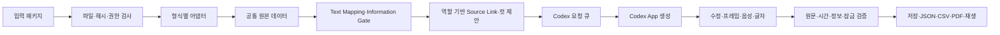

# 범용 콘티 도구 — Design

상태: 1.3.0 도메인 계약, 정보 공개 시간 안전장치, 대표 실제 구간의 Codex App 생성·PRJ-007 Golden 검증을 반영한 현재 설계. 전체 분량의 제작 판단은 별도 검토가 필요하다.

## 1. 목표와 결정 근거

[Plan](../../01-plan/features/storyboard-generator.plan.md)과 루트 AGENTS.md의 범용성 원칙을 적용한다. 연결된 「콘티 툴 제작」 검토의 입력 계약, Frame 계층, 시간 단위, 인물 출연 형태, 제안과 확정 분리를 반영한다. 검토의 단계 분리는 개발 순서이며 그림·가이드 음성·편집·내보내기라는 최종 범위를 축소하지 않는다.

기존 Python 검증기는 crime contract, channel, 고정 모드 조합 등 상위 제작 파이프라인에 의존한다. 호출 계약과 구현을 확인했으며 이를 범용 앱의 필수 런타임 의존성으로 가져오지 않는다. 원본과 ID·시간·해시 규약은 입력 어댑터로 보존하고, 새 프로젝트 모델의 검증은 별도로 수행한다. 기존 저장소는 변경하지 않는다.

TypeScript와 Node.js로 데이터 계약을 브라우저·서버에서 공유한다. Zod를 타입·런타임 입력 검증의 기준으로 삼고 JSON Schema를 생성하여 이중 정의를 피한다. [Zod의 JSON Schema 변환](https://zod.dev/json-schema)은 구조를 출력하며, ID 관계·시간 합계·원문 보존 같은 의미 검사는 별도 함수로 수행한다. 테스트는 [Vitest](https://vitest.dev/guide/)로 실행한다. UI·HTTP·생성 제공자는 뒤 단계에서 같은 계약에 연결한다.

## 2. 구조와 데이터 흐름

- `src/domain`: 타입·스키마, 정규화된 프로젝트, Text/Source Mapping, 시간·원문·정보 Gate 검사, 순수 편집 함수.
- `src/importers`: 패키지 검사, 범용 native 입력, 기존 production 입력의 명시적 변환.
- `src/proposal`: 구간의 허용된 원문을 이용한 컷 제안과 모델 요청 경계.
- `src/exporters`: 검증된 프로젝트의 JSON·CSV·PDF 출력.
- `src/io`: 입력 파일과 프로젝트 JSON 읽기·쓰기. 입력 경로는 패키지 루트 안으로 제한한다.
- `src/server`: 프로젝트별 현재본·불변 revision·자산 저장, 낙관적 revision 검사와 로컬 HTTP API.
- `src/codex`: Codex 요청 영속화, 최소 생성 문맥, 대상 해시, 결과 검증·반영과 명령행 브리지.
- `.agents/skills/storyboard-workbench`: Codex App이 컷·내장 이미지 생성·로컬 가이드 음성 요청을 처리하는 저장소 스킬.
- `web`: 공통 프로젝트 모델을 표시하고 편집·생성·재생·원본 갱신·내보내기를 API에 요청하는 React 화면.

## 3. 입력 계약과 원본 권한

`storyboard_handoff.json`은 기존 production manifest와 별개다. 필수 정보는 계약 버전, 어댑터·버전, 프로젝트 ID, 패키지 버전, 상위 revision, 명시적 시간 기준·제작 설정, 파일 역할·경로·필수 여부·해시, 데이터 필드별 권한 파일이다.

초기 어댑터는 `native-v1`, `production-v1`이다. 이름에 포함된 v1은 어댑터 계약 버전이며 원본 파일별 schema version과 구분한다. 새 프로젝트 ID, 다른 분량·모드, 패널 없는 프로젝트도 같은 native 계약으로 처리한다. 새 문서 형식은 별도 어댑터가 필요하다.

| 데이터 역할 | native-v1 | production-v1 |
|---|---|---|
| 프로젝트·장면·구간·대본·인물·위치 | native 데이터 파일 | screenplay, presentation, characters, panel-cast, scene-cards 역할의 파일 |
| 재연·내레이션 원문 | native units | screenplay units |
| 패널 원문 | 선택적 PANEL units | 반응 구간에 연결된 reaction turns |
| 시간 | 명시적 정수 ms | presentation의 초를 정확한 정수 ms로 변환 |
| 공개 정보 | 명시적 information rules | presentation의 최초 공개 fact/clue |
| 촬영·편집 의도와 자막 큐 | native instructions/text cues | shooting/edit/subtitles의 명시적 구간·시각 연결 |
| 사람용 대본 | 선택적 참조 view | 검토용 view, 발화의 새 원본으로 재삽입하지 않음 |

원본 파일의 내용과 해시를 스냅샷으로 저장한다. 가져오기 결과는 정규화된 데이터와 발견 항목을 함께 가진다. 구조·해시·필수 참조 오류는 가져오기를 실패시키며, 제작 판단이 필요한 문구·인물·장소 차이는 충돌로 보존한다. 원문을 자동 교정하지 않는다. 선택 파일이 정상적으로 없는 경우와 필수 파일 누락을 구분한다.

정규 JSON 해시는 기존 제작 형식과 호환되는 유니코드 키 정렬·공백 제거를 적용한다. 지원 수치 범위는 안전한 정수 표기로 한정하며 소수·지수·큰 정수·단독 surrogate는 명시적으로 거부한다. 원본 그대로의 일반 파일 해시는 UTF-8 바이트 SHA-256으로 검사한다. production manifest가 있으면 footprint와 선언된 산출물 해시를 함께 검사한다. footprint의 패키지에 포함된 장면·인물 참조를 검증하며 상위 파이프라인 전체의 검증 상태를 대신 보고하지 않는다.

native 파일은 일반적인 프로젝트 원본을 표현한다. ID는 불투명 문자열이며 접두사나 배열 위치에서 인물 의미를 유추하지 않는다. production 형식의 필드와 고정된 파일 목록은 그 어댑터에서만 다룬다. 패키지에는 실제 파일 역할을 기록하므로 가져오기 시 디렉터리를 무제한 탐색하지 않는다.

## 4. 도메인 모델

- `Project → Scene → Segment → Shot → StoryboardFrame`. 각 관계는 프로젝트 범위의 ID로 연결한다.
- 원문 `SourceUnit`은 발화, 내레이션, 패널 발화, 지문, 화면 글자, 채팅, 메모, 효과음, 음악을 구분한다. 원문 문자열과 출처는 편집 지시와 분리한다.
- `Shot`은 구간, 화면 위치, 구도·각도·이동, 행동 제안, 출연 형태, 소품, 연속성 전후 상태, 다음 컷으로 나가는 전환, 원문 참조를 가진다.
- `StoryboardFrame`은 컷의 시작·종료·중간 keyframe과 이미지 자산을 별도로 연결한다. 컷 하나에 이미지 하나를 강제하지 않는다.
- `AudioCue`와 `TextCue`는 영상 컷과 독립된 시작·종료를 가진다. 오디오는 발화·VO·패널·SFX·음악을 구분한다. 채팅·메모를 자동 낭독하지 않는다.
- `TextMappingDecision`은 자막 Placement와 Canonical 원문의 관계를 `exact`, `abbreviation`, `separate-element`, `replacement`, `standalone-placement`로 기록한다. 명시적 `placement.unitId`, 허용 종류의 유일한 정확 일치, 유일한 휴리스틱 후보 순서로 찾는다. 중복 정확 일치는 자동 선택하지 않는다. 관계마다 Canonical 연결·별도 렌더링·시간 범위의 불변식을 검사한다. `separate-element`의 Placement Cue는 Canonical Unit을 소유하지 않고, 별도 Canonical Cue만 명시한 시각과 Unit을 가진다.
- `ShotSourceLink`는 컷과 원문 Unit의 권한 관계다. `primary-visual`, `continued-visual`, `audio-only`, `context-only` 용도와 `confirmed`, `mapping-required` 상태, `shot-offset`·`frame`·`unresolved` 시간 Anchor를 가진다. `SOUND`와 `MUSIC`은 직접 시각 근거가 될 수 없고 `continued-visual`은 앞선 `primary-visual`을 요구한다. `sourceUnitIds`는 1.3.0 프로젝트에 중복 저장하지 않는다.
- 인물의 역할·시각 기준과 컷의 실제 출연 형태를 분리한다. 출연 형태는 VISIBLE, HAND_ONLY, SILHOUETTE, OFFSCREEN_VOICE, VOICE_OVER, IMPLIED, ARCHIVE_IMAGE다. 목록에 없으면 그 컷의 출연이 선언되지 않은 상태다.
- 장소는 이야기 장소와 화면 장소를 분리한다. 모호한 장소를 이야기 장소로 자동 확정하지 않는다.
- `Asset`은 종류, 경로, SHA-256, 시각 설명, 원문과 독립된 버전을 가진다. 인물 의상·소품 상태·공간 축은 컷의 연속성 상태로 표현한다.
- 원문 출처는 파일 ID·locator·원본 ID로 추적한다. 파일 스냅샷과 프로젝트 ID를 함께 저장하여 다른 프로젝트의 동일 원본 ID와 충돌하지 않는다.

## 5. 시간과 정보 공개

내부 시간은 프로젝트 시작에 대한 정수 밀리초와 반열린 구간 `[startMs, endMs)`로 저장한다. FPS는 유리수, drop-frame 여부, 오디오 sample rate, 시작 timecode는 프로젝트 설정으로 둔다. 밀리초↔프레임 변환의 반올림 정책을 명시하고 저장 시간표를 표시 문자열로 역산하지 않는다. Drop-frame 지원 범위는 검증된 조합으로 제한한다.

구간에는 fixed/proposed 시간 상태가 있다. 미정 시간은 임의의 25분으로 채우지 않는다. 음성은 proposed/measured 상태를 별도로 가지며, 실제 가이드 음성 길이를 측정하기 전 낭독 가능성을 통과로 판정하지 않는다. J/L컷의 오디오 구간은 의도적으로 영상 구간을 넘어갈 수 있지만 전체 타임라인 범위를 넘지 않아야 한다.

정보 공개 규칙은 information ID, 최초 Segment, 최초 Unit과 순서, 권한 하한 `baseNotBeforeMs`, `exact-time`·`unit-order`·`segment-start` 정밀도를 가진다. `effectiveNotBeforeMs`는 저장 필드가 아니며 확정 Text Mapping, 확정 Source Temporal Anchor, 같은 Segment의 유효한 측정 Audio Cue, 유일한 Unit 순서 근거에서 매 검사마다 계산한다. 어떤 근거도 기준 하한을 앞당길 수 없다. Source나 Audio가 더 늦은 Unit-order 근거보다 앞서면 후반 근거를 유효 하한으로 유지하고 충돌을 검토 항목으로 만든다. Unit 순서만 있고 확정 시간 근거가 없으면 검토 필요 상태로 남겨 승인과 생성을 막는다. 프레임 Prompt는 `shot.startMs + frame.offsetMs`와 해당 시각에 활성화된 직접 시각 Link 및 Text Mapping만 함께 검사한다. 모든 시간 활성 구간은 `[startMs, endMs)`로 판정한다. 금지 사실의 설명 자체를 이미지 prompt에 넣지 않는다. 기록된 정보 ID를 비교하는 검사는 의미적·시각적 반전 누설을 완전히 검증하지 못하므로 그림 검토 상태를 따로 둔다.

## 6. 제안·잠금·충돌 처리

결정적인 가져오기·검증과 창의적인 컷 제안을 분리한다. 초기 수동 편집용 컷 뼈대와 향후 AI 제안은 출처·생성 방식을 표시한다. 모델이 쓴 대사를 원문으로 채택하지 않고 원문 ID를 통해 출력한다.

컷은 proposed/approved 상태와 잠근 필드를 가진다. 재생성은 원문·확정 시간·잠긴 필드를 변경할 수 없다. 컷 분할은 Audio/Text 타이밍을 기준으로 Source Link를 한쪽 또는 양쪽 continuation에 배분한다. 시간 근거가 없는 Link는 Unit 순서로 한쪽 후보에만 두고 `mapping-required`로 표시한다. 합치기·재정렬은 Link의 용도와 상태를 보존하며 Source Unit 역전을 구조 오류로 거부한다. 잠금과 충돌을 해결하지 못한 요청은 이전 프로젝트 상태를 보존한 채 명시적 오류로 끝낸다.

초안은 `unresolved` Text Mapping과 `mapping-required` Source Link를 포함할 수 있다. 관련 컷 승인, 이미지 생성, 구간 컷 제안 적용은 검토가 끝날 때까지 차단한다. Mapping·측정 Audio·Anchor 연결 프레임의 시각 변경은 관련 컷을 proposed로 돌리고 Frame의 시각 검토를 pending으로 바꾼다. 프레임 시각 변경은 해당 `frame` Anchor를 `unresolved/frame-change`로 전환한다. Source Mapping, Text Mapping, Information Gate, Frame offset, Text Placement가 달라지면 Codex 요청의 basis hash도 달라진다.

원본 변경은 파일 해시와 unit ID·문자열·시간 변화로 비교한다. 사용자 수정과 영향을 받는 컷을 구분하고 원본을 자동 덮어쓰지 않는다. 첫 버전은 파일마다 별도 revision과 프로젝트 revision을 사용한다.

검토에서 지적한 SCN-08 출연 문제는 특정 인물을 삭제·추가하는 코드로 해결하지 않는다. Scene cast는 원본의 선언 범위로 보존하고, 내레이션 화자와 화면 출연을 구분한다. 원본 간 차이는 검토 항목으로 제시한다.

## 7. 편집 화면과 API 경계

화면은 프로젝트 목록·불러오기, 장면/구간 탐색, 컷 보드, 원문/연출/트랙 상세, 타임라인 재생, 검토 패널로 구성한다. 작품 ID·등장인물·특정 모드가 UI에 고정되지 않는다.

| API | 역할 |
|---|---|
| POST /api/projects/import | 명시적인 패키지 경로 검증·가져오기 |
| GET /api/projects | 독립 저장 프로젝트 목록 |
| GET /api/projects/:id | 현재 revision과 작업 상태 |
| PATCH/POST /api/projects/:id/profile, shots, frames, references | expected revision 검사 후 편집·잠금·검토·기준 자산 저장 |
| PATCH /api/projects/:id/audio/:cueId, text/:cueId | 독립 트랙의 시작·종료와 글자 표현 방식 편집 |
| GET /api/projects/:id/mapping-review | unresolved Text Mapping, mapping-required Source Link, 정보 조기 공개 항목 조회 |
| PATCH /api/projects/:id/text-mappings/:decisionId | expected revision으로 자막 관계·상태·별도 표시 시각 수정 |
| PATCH /api/projects/:id/shots/:shotId/source-links | expected revision으로 현재 컷 Source Link 전체 수정 |
| POST /api/projects/:id/shots/:shotId/source-links/move | expected revision으로 같은 구간의 다른 컷으로 Link 이동 |
| POST /api/projects/:id/source-impact | 새 입력 패키지의 변경 영향 미리보기 |
| POST /api/projects/:id/source-update | 잠금 충돌 검사 후 영향 구간만 새 원본으로 교체 |
| POST /api/projects/:id/segments/:segmentId/propose | 구간별 컷 제안 작업 |
| POST /api/projects/:id/frames/:frameId/generate | 선택 프레임 이미지 생성 작업 |
| POST /api/projects/:id/audio/:cueId/generate | 선택 발화 가이드 음성 생성 작업 |
| GET /api/status, /api/codex/requests/:id | 영속 생성 요청의 완료·대기·실패, 처리 시간·반복 생성, 오류·결과 revision |
| GET /api/projects/:id/export.json, .csv, .pdf | 검토 상태를 포함한 결과 출력 |

서버는 로컬 주소에 바인딩한다. API는 생성 버튼을 누른 시점의 최소 문맥 해시와 대상을 영속 요청으로 저장하며 외부 생성 서비스를 직접 호출하지 않는다. 웹 편집과 생성 실행은 서로 막지 않는다. Codex App 결과를 적용할 때 현재 대상 문맥 해시가 다르면 오래된 요청으로 거부한다. 빈 자산이나 다른 제공자로 자동 대체하지 않는다.

생성은 Codex App의 현재 모델과 내장 `image_gen`에서 수행한다. 가이드 음성은 Codex App 작업이 원문 파일을 준비한 뒤 설정된 macOS 한국어 음성으로 만들고 PCM WAV로 변환한다. `OPENAI_API_KEY`와 OpenAI SDK를 사용하지 않는다. 생성 요청과 결과 revision은 `.local` 아래에 프로젝트별 데이터와 분리해 저장하고, 결과 자산에는 요청 ID·prompt·도구 이름·참조 해시를 기록한다. 요청의 생성·종료 시각으로 처리 시간을 집계하고 같은 프로젝트·종류·대상에 대한 추가 요청을 반복 생성으로 계산한다. Codex App이 요청별 비용을 노출하지 않는 상태는 0원이 아니라 미측정으로 표시한다.

## 8. 검증 계획과 구현 순서

1. 버전 고정 패키지, 1.3.0 스키마·타입, 1.0.0→1.1.0→1.2.0→1.3.0 Migration, 파일 해시·경로·권한 검사, native 입력: 구현 및 자동 검증됨.
2. 실제 제작 자료의 production 어댑터, 최소 합성 native 프로젝트, 원문·시간·선택 요소 검증: 구현 및 자동 검증됨.
3. 컷·시작/키/끝 프레임·독립 트랙·전환 생성과 편집·잠금, Text Mapping 상태 기계·Source Temporal Anchor·동적 Information Gate, JSON/CSV/PDF 보존: 구현 및 자동 검증됨.
4. 로컬 저장/API·Mapping 편집 UI, 프로젝트 분리·재열기·원본 차이: 구현 및 자동 검증됨.
5. 시각 기준, Codex App 컷·이미지·음성 요청과 결과 반영, 재생, PDF 출력: 구현 및 자동 검증됨. 합성 범용 사례와 PRJ-007 `SEG-008`의 실제 생성 흐름을 확인했다.
6. 두 가지 이상의 구성으로 회귀·브라우저 검증, 전체 요구사항 감사: 합성 자료와 초기 회귀 자료의 가져오기·편집·출력을 검증했다. PRJ-007 Golden에서 전체 구조·원문·시간과 `SEG-024`의 1,088,000ms, 1,108,000ms, 1,148,000ms 공개 순서를 검증했다. 실제 생성 사례에서는 5개 컷의 시간 합계, 첫 프레임 재생성·승인, 한 발화의 WAV 길이 반영을 확인했다. 전체 분량의 시각·낭독 검토는 남아 있다.

필수 자동 검증은 원문 100% 보존과 단위 연결, 영상 시간 공백·중복, 잘못된 ID·구간 소유권, 미지원 버전·손상 해시, 공개 시점 위반, 잠근 필드 변경, 프로젝트 혼입, 저장·출력 정합성이다. 실제 제작 사례 수치는 fixture에만 둔다. 패널·반전이 없는 다른 분량의 프로젝트와 원본 ID가 겹치는 프로젝트도 검증한다.

원본 데이터의 모호한 시각 정보·자막 축약·표현 조건은 충돌/검토 상태로 남겨 정상 동작과 구분한다. 파서·문자열 검사가 통과했다고 이미지 품질과 제작 가능성이 검증됐다고 보고하지 않는다. 제품의 최종 완료는 그림·오디오·편집·출력까지 실제 동작과 결과를 확인한 뒤 판정한다.

이 설계는 하나의 현재 상태 문서로 유지한다. 구체적인 필드 정의는 소스 스키마와 생성된 JSON Schema가 기준이다. 별도 설명 문서에 같은 정의를 반복하지 않는다.
