# 범용 콘티 도구 — Design

상태: 1.6.0 도메인 계약, Proposal Frame Plan·Visual Mode와 전체 Source Coverage, 열린 Placement의 유효 종료 시각, Absolute·Duration timecode, 전체 Version 합집합 Historical Generation Audit, 공유 주기 Process Heartbeat, Recovery Marker Quarantine, 현재 출력 참조 Asset Integrity, 실제 미디어 검사, journal version 3 저장·복구, Cue 범위 Audio 수명주기, 안전 Frame·Audio 출력, Playwright E2E와 PRJ-007 Golden을 반영한 현재 설계. 전체 분량의 제작 판단은 별도 검토가 필요하다.

## 1. 목표와 결정 근거

[Plan](../../01-plan/features/storyboard-generator.plan.md)과 루트 AGENTS.md의 범용성 원칙을 적용한다. 연결된 「콘티 툴 제작」 검토의 입력 계약, Frame 계층, 시간 단위, 인물 출연 형태, 제안과 확정 분리를 반영한다. 검토의 단계 분리는 개발 순서이며 그림·가이드 음성·편집·내보내기라는 최종 범위를 축소하지 않는다.

기존 Python 검증기는 crime contract, channel, 고정 모드 조합 등 상위 제작 파이프라인에 의존한다. 호출 계약과 구현을 확인했으며 이를 범용 앱의 필수 런타임 의존성으로 가져오지 않는다. 원본과 ID·시간·해시 규약은 입력 어댑터로 보존하고, 새 프로젝트 모델의 검증은 별도로 수행한다. 기존 저장소는 변경하지 않는다.

TypeScript와 Node.js로 데이터 계약을 브라우저·서버에서 공유한다. Zod를 타입·런타임 입력 검증의 기준으로 삼고 JSON Schema를 생성하여 이중 정의를 피한다. [Zod의 JSON Schema 변환](https://zod.dev/json-schema)은 구조를 출력하며, ID 관계·시간 합계·원문 보존 같은 의미 검사는 별도 함수로 수행한다. 테스트는 [Vitest](https://vitest.dev/guide/)로 실행한다. UI·HTTP·생성 제공자는 뒤 단계에서 같은 계약에 연결한다.

## 2. 구조와 데이터 흐름

```mermaid
flowchart LR
    A[입력 패키지] --> B[파일·해시·권한 검사]
    B --> C[형식별 어댑터]
    C --> D[공통 원본 데이터]
    D --> M[Text Mapping·Information Gate]
    M --> E[역할 기반 Source Link·컷 제안]
    E --> Q[Codex 요청 큐]
    Q --> X[Codex App 생성]
    X --> F[수정·프레임·음성·글자]
    F --> G[원문·시간·정보·잠금 검증]
    G --> I[Information Emission Interlock]
    I --> H[저장·JSON·CSV·PDF·재생]
```

- `src/domain`: 타입·스키마, 정규화된 프로젝트, Text/Source Mapping, 시간·원문·정보 Gate 검사, 출력 인터록, 안전한 재생 선택자, 순수 편집 함수와 제한된 Audio Worker connector.
- `src/importers`: 패키지 검사, 범용 native 입력, 기존 production 입력의 명시적 변환.
- `src/proposal`: 구간의 허용된 원문을 이용한 컷 제안과 모델 요청 경계.
- `src/exporters`: 검증된 프로젝트의 JSON·CSV·PDF 출력.
- `src/io`: 입력 파일과 프로젝트 JSON 읽기·쓰기. 입력 경로는 패키지 루트 안으로 제한한다.
- `src/server`: canonical data root와 symlink-safe 파일 연산, 프로젝트별 현재본·불변 revision·자산의 file identity 기반 journal transaction, create/update 시작 복구, 영속 recovery block, 낙관적 revision 검사와 로컬 HTTP API.
- `src/codex`: Codex 요청 영속화, 최소 생성 문맥, 대상 해시, 결과 검증·반영과 명령행 브리지.
- `.agents/skills/storyboard-workbench`: Codex App이 컷·내장 이미지 생성·로컬 가이드 음성 요청을 처리하는 저장소 스킬.
- `web`: 공통 프로젝트 모델을 표시하고 편집·생성·Cue 범위 Audio 재생·원본 갱신·내보내기를 API에 요청하는 React 화면.

## 3. 입력 계약과 원본 권한

`storyboard_handoff.json`은 기존 production manifest와 별개다. 필수 정보는 계약 버전, 어댑터·버전, 프로젝트 ID, 패키지 버전, 상위 revision, 명시적 시간 기준·제작 설정, 파일 역할·경로·필수 여부·해시, 데이터 필드별 권한 파일이다.

초기 어댑터는 `native-v1`, `production-v1`이다. 이름에 포함된 v1은 어댑터 계약 버전이며 원본 파일별 schema version과 구분한다. 새 프로젝트 ID, 다른 분량·모드, 패널 없는 프로젝트도 같은 native 계약으로 처리한다. 새 문서 형식은 별도 어댑터가 필요하다.

| 데이터 역할 | native-v1 | production-v1 |
|---|---|---|
| 프로젝트·장면·구간·대본·인물·위치 | native 데이터 파일 | screenplay, presentation, characters, panel-cast, scene-cards 역할의 파일 |
| 재연·내레이션 원문 | native units | screenplay units |
| 패널 원문 | 선택적 PANEL units | 반응 구간에 연결된 reaction turns |
| 시간 | 명시적 정수 ms | presentation의 초를 정확한 정수 ms로 변환 |
| 공개 정보 | 명시적 information rules | presentation의 최초 공개 fact/clue |
| 촬영·편집 의도와 자막 큐 | native instructions/text cues | shooting/edit/subtitles의 명시적 구간·시각 연결 |
| 사람용 대본 | 선택적 참조 view | 검토용 view, 발화의 새 원본으로 재삽입하지 않음 |

원본 파일의 내용과 해시를 스냅샷으로 저장한다. 가져오기 결과는 정규화된 데이터와 발견 항목을 함께 가진다. 구조·해시·필수 참조 오류는 가져오기를 실패시키며, 제작 판단이 필요한 문구·인물·장소 차이는 충돌로 보존한다. 원문을 자동 교정하지 않는다. 선택 파일이 정상적으로 없는 경우와 필수 파일 누락을 구분한다.

정규 JSON 해시는 기존 제작 형식과 호환되는 유니코드 키 정렬·공백 제거를 적용한다. 지원 수치 범위는 안전한 정수 표기로 한정하며 소수·지수·큰 정수·단독 surrogate는 명시적으로 거부한다. 원본 그대로의 일반 파일 해시는 UTF-8 바이트 SHA-256으로 검사한다. production manifest가 있으면 footprint와 선언된 산출물 해시를 함께 검사한다. footprint의 패키지에 포함된 장면·인물 참조를 검증하며 상위 파이프라인 전체의 검증 상태를 대신 보고하지 않는다.

native 파일은 일반적인 프로젝트 원본을 표현한다. ID는 불투명 문자열이며 접두사나 배열 위치에서 인물 의미를 유추하지 않는다. production 형식의 필드와 고정된 파일 목록은 그 어댑터에서만 다룬다. 패키지에는 실제 파일 역할을 기록하므로 가져오기 시 디렉터리를 무제한 탐색하지 않는다.

## 4. 도메인 모델

- `Project → Scene → Segment → Shot → StoryboardFrame`. 각 관계는 프로젝트 범위의 ID로 연결한다.
- 원문 `SourceUnit`은 발화, 내레이션, 패널 발화, 지문, 화면 글자, 채팅, 메모, 효과음, 음악을 구분한다. 원문 문자열과 출처는 편집 지시와 분리한다.
- `Shot`은 구간, 화면 위치, 구도·각도·이동, 행동 제안, 출연 형태, 소품, 연속성 전후 상태, 다음 컷으로 나가는 전환, 원문 참조를 가진다.
- `StoryboardFrame`은 컷의 시작·종료·중간 keyframe과 이미지 자산을 별도로 연결한다. 컷 하나에 이미지 하나를 강제하지 않는다.
- `AudioCue`와 `TextCue`는 영상 컷과 독립된 시작·종료를 가진다. 오디오는 발화·VO·패널·SFX·음악을 구분하고 원본 Segment와의 관계를 `within-segment`, `j-cut`, `l-cut`으로 명시한다. 실제 Audio Asset 등록은 모든 Cue 종류에 열려 있고 파일에서 측정한 길이로 Cue 종료점을 다시 정한다. Text Cue는 Placement, 확정 Mapping, Source Unit 또는 `review-required` 권한을 기록한다. Placement 출력은 정확히 하나의 확정 Mapping Decision을 요구하고, `separate-element` Placement는 Canonical 정보를 상속하지 않는다. Canonical Cue는 `mappingDecisionId`로 식별한다. 채팅·메모를 자동 낭독하지 않는다.
- `TextMappingDecision`은 자막 Placement와 Canonical 원문의 관계를 `exact`, `abbreviation`, `separate-element`, `replacement`, `standalone-placement`로 기록한다. 명시적 `placement.unitId`, 허용 종류의 유일한 정확 일치, 유일한 휴리스틱 후보 순서로 찾는다. 중복 정확 일치는 자동 선택하지 않는다. 관계마다 Canonical 연결·별도 렌더링·시간 범위의 불변식을 검사한다. `separate-element`의 Placement Cue는 Canonical Unit을 소유하지 않고, 별도 Canonical Cue만 명시한 시각과 Unit을 가진다.
- `TextPlacementInformationDecision`은 독립 관계의 Placement마다 최대 하나 존재한다. `unresolved`는 출력 차단, `non-informational`은 정보 없음의 사용자 확정, `informational`은 하나 이상의 Information ID와 Gate 검사를 뜻한다. Canonical 상속 관계에는 이 판정을 두지 않는다. 관계 변경은 판정 생성·제거를 같은 project mutation에서 처리한다.
- `ShotSourceLink`는 컷과 원문 Unit의 권한 관계다. `primary-visual`, `continued-visual`, `audio-only`, `context-only` 용도와 `confirmed`, `mapping-required` 상태, `shot-offset`·`frame-range`·`frame`·`unresolved` 시간 Anchor를 가진다. `SOUND`와 `MUSIC`은 직접 시각 근거가 될 수 없고 `continued-visual`은 앞선 `primary-visual`을 요구한다. `sourceUnitIds`는 1.8.0 프로젝트에 중복 저장하지 않는다.
- `Shot.visualMode`는 `sourced`, `black`, `hold-previous` 중 하나다. `sourced`는 confirmed 직접 시각 Anchor의 반열린 합집합이 Shot 전체를 덮어야 하며 공백은 구조화된 검토 이슈다. Proposal Apply는 공백을 거부하고 Anchor 시작점마다 결정적 Key Frame을 만든다. `black`은 자산 없이 결정적 검은 화면을 출력하고, `hold-previous`는 시간상 인접한 직전 Shot의 안전 Frame을 참조한다. 두 비생성 Mode에는 직접 시각 Link를 둘 수 없다.
- 인물의 역할·시각 기준과 컷의 실제 출연 형태를 분리한다. 출연 형태는 VISIBLE, HAND_ONLY, SILHOUETTE, OFFSCREEN_VOICE, VOICE_OVER, IMPLIED, ARCHIVE_IMAGE다. 목록에 없으면 그 컷의 출연이 선언되지 않은 상태다.
- 장소는 이야기 장소와 화면 장소를 분리한다. 모호한 장소를 이야기 장소로 자동 확정하지 않는다.
- `Asset`은 종류, 경로, SHA-256, 시각 설명, 원문과 독립된 버전을 가진다. 인물 의상·소품 상태·공간 축은 컷의 연속성 상태로 표현한다.
- 원문 출처는 파일 ID·locator·원본 ID로 추적한다. 파일 스냅샷과 프로젝트 ID를 함께 저장하여 다른 프로젝트의 동일 원본 ID와 충돌하지 않는다.

## 5. 시간과 정보 공개

내부 시간은 프로젝트 시작에 대한 정수 밀리초와 반열린 구간 `[startMs, endMs)`로 저장한다. FPS는 유리수, drop-frame 여부, 오디오 sample rate, 시작 timecode는 프로젝트 설정으로 둔다. Absolute timecode는 시작 timecode를 한 번 더하고 Duration은 0에서 시작하는 별도 formatter로 계산한다. 모든 변환은 BigInt 정수 프레임 산술을 사용하고 저장 시간표를 표시 문자열로 역산하지 않는다. 29.97·59.94 drop-frame의 분 경계와 24시간 wrap을 검사한다.

종료가 없는 Text Placement는 같은 Placement의 명시적 Text Cue 종료, 유일한 confirmed Mapping의 canonical 종료 순으로 유효 범위를 정한다. 두 근거가 없거나 후보가 모호하면 종료를 추측하지 않고 검토 이슈를 내며, Frame Context·Program Monitor·PDF·CSV는 같은 유효 범위를 사용한다.

구간에는 fixed/proposed 시간 상태가 있다. 미정 시간은 임의의 25분으로 채우지 않는다. 음성은 proposed/measured 상태를 별도로 가지며, 실제 가이드 음성 길이와 Audio Cue의 명시적 관계를 검증하기 전 낭독 가능성을 통과로 판정하지 않는다. `j-cut`은 바로 앞 Segment에서 시작해 원본 Segment 안에서 끝나고, `l-cut`은 원본 Segment에서 시작해 바로 다음 Segment 안에서 끝난다. J/L-cut은 Information Gate 증거가 아니다. 시간이나 관계를 바꾸면 measured 상태와 Audio 기반 Anchor를 무효화한다.

정보 공개 규칙은 information ID, 최초 Segment, 최초 Unit과 순서, 권한 하한 `baseNotBeforeMs`, `exact-time`·`unit-order`·`segment-start` 정밀도를 가진다. `effectiveNotBeforeMs`는 저장 필드가 아니며 확정 Text Mapping, 확정 Source Temporal Anchor, 같은 Segment의 유효한 `within-segment` 측정 Audio Cue, 유일한 Unit 순서 근거에서 매 검사마다 계산한다. 어떤 근거도 기준 하한을 앞당길 수 없다. Source나 Audio가 더 늦은 Unit-order 근거보다 앞서면 후반 근거를 유효 하한으로 유지하고 충돌을 검토 항목으로 만든다. Unit 순서만 있고 확정 시간 근거가 없으면 검토 필요 상태로 남겨 승인과 생성을 막는다.

Information Emission Interlock은 이미지, 글자 오버레이, 음성 재생·생성, 컷 제안, PDF·CSV 출력에 같은 공개 판정을 적용한다. 출력 대상은 정보 ID의 원본 근거와 유효 Gate를 가져야 하며, 미해결 규칙·검토 필요 Gate·조기 공개는 차단한다. Program Monitor와 실제 오디오 요소는 안전 선택자의 결과만 렌더링하고 차단된 Cue는 본문 대신 ID와 Issue code를 표시한다. 브라우저 Audio controller는 Cue 종료 timer와 playhead 범위를 함께 확인하고, 일시정지·탐색·프로젝트 또는 revision 변경·Monitor 종료 때 활성 요소를 정리한다. 늦게 끝난 이전 `play()` Promise와 timer는 현재 entry identity가 같을 때만 상태를 바꿀 수 있다. `reviewFrameOutput`은 Program Monitor, 전환 미리보기, PDF, CSV에서 자산 대상과 검토·Source·Gate 상태를 같은 방식으로 판정한다. bitmap이 차단돼도 JSON의 Frame 연결과 Asset은 감사용으로 유지한다.

프레임 Prompt와 출력 검사는 해당 시각에 활성화된 직접 시각 Link 및 Text Mapping만 사용한다. 일반 프레임의 표시·평가 시각은 `shot.startMs + frame.offsetMs`다. End Frame은 컷 종료점에 표시하지만 `[startMs, endMs)` 계약에 따라 `endMs - 1`에서 평가한다. 금지 사실의 설명 자체를 이미지 prompt에 넣지 않는다. 기록된 정보 ID를 비교하는 검사는 의미적·시각적 반전 누설을 완전히 검증하지 못하므로 그림 검토 상태를 따로 둔다.

## 6. 제안·잠금·충돌 처리

결정적인 가져오기·검증과 창의적인 컷 제안을 분리한다. 초기 수동 편집용 컷 뼈대와 향후 AI 제안은 출처·생성 방식을 표시한다. 모델이 쓴 대사를 원문으로 채택하지 않고 원문 ID를 통해 출력한다.

컷은 proposed/approved 상태와 잠근 필드를 가진다. 재생성은 원문·확정 시간·잠긴 필드를 변경할 수 없다. 컷 분할은 Audio/Text 타이밍을 기준으로 Source Link를 한쪽 또는 양쪽 continuation에 배분한다. 시간 근거가 없는 Link는 Unit 순서로 한쪽 후보에만 두고 `mapping-required`로 표시한다. 합치기·재정렬은 Link의 용도와 상태를 보존하며 Source Unit 역전을 구조 오류로 거부한다. 잠금과 충돌을 해결하지 못한 요청은 이전 프로젝트 상태를 보존한 채 명시적 오류로 끝낸다.

초안은 `unresolved` Text Mapping과 `mapping-required` Source Link를 포함할 수 있다. 관련 컷 승인, 이미지 생성, 구간 컷 제안 적용은 검토가 끝날 때까지 차단한다. Mapping·측정 Audio·Anchor 연결 프레임의 시각 변경은 관련 컷을 proposed로 돌리고 Frame의 시각 검토를 pending으로 바꾼다. 프레임 시각·역할 변경은 해당 `frame`·`frame-range` Anchor를 `unresolved/frame-change`로 전환한다. Source Mapping, Text Mapping, Information Gate, Frame offset, Text Placement가 달라지면 Codex 요청의 basis hash도 달라진다.

원본 변경은 파일 해시와 unit ID·문자열·시간 변화로 비교한다. 사용자 수정과 영향을 받는 컷을 구분하고 원본을 자동 덮어쓰지 않는다. 첫 버전은 파일마다 별도 revision과 프로젝트 revision을 사용한다.

검토에서 지적한 SCN-08 출연 문제는 특정 인물을 삭제·추가하는 코드로 해결하지 않는다. Scene cast는 원본의 선언 범위로 보존하고, 내레이션 화자와 화면 출연을 구분한다. 원본 간 차이는 검토 항목으로 제시한다.

## 7. 편집 화면과 API 경계

화면은 프로젝트 목록·불러오기, 장면/구간 탐색, 컷 보드, 원문/연출/트랙 상세, 타임라인 재생, 검토 패널로 구성한다. 작품 ID·등장인물·특정 모드가 UI에 고정되지 않는다.

| API | 역할 |
|---|---|
| POST /api/projects/import | 명시적인 패키지 경로 검증·가져오기 |
| GET /api/projects | 독립 저장 프로젝트 목록 |
| GET /api/projects/:id | 현재 revision과 작업 상태 |
| PATCH/POST /api/projects/:id/profile, shots, frames, references | expected revision 검사 후 편집·잠금·검토·기준 자산 저장 |
| PATCH /api/projects/:id/audio/:cueId, text/:cueId | 독립 트랙의 시작·종료와 글자 표현 방식 편집 |
| POST /api/projects/:id/text/:cueId/authority | review-required Text Cue를 Placement·Mapping Decision·Source Unit 권한에서 재구성 |
| DELETE /api/projects/:id/text/:cueId | expected revision과 필수 커버리지를 검사한 review-required Cue 삭제 |
| GET /api/projects/:id/mapping-review | unresolved Text Mapping, mapping-required Source Link, 정보 조기 공개 항목 조회 |
| GET /api/projects/:id/generation-audit | 모든 Version의 Record 합집합과 도입 revision, current·historical·unresolved Target 감사 |
| GET /api/projects/:id/asset-integrity | 현재 출력이 참조하는 Frame·Audio·Reference·Prop·Continuity 자산 재검증 |
| PATCH /api/projects/:id/text-mappings/:decisionId | expected revision으로 자막 관계·상태·별도 표시 시각 수정 |
| PATCH /api/projects/:id/shots/:shotId/source-links | expected revision으로 현재 컷 Source Link 전체 수정 |
| POST /api/projects/:id/shots/:shotId/source-links/move | expected revision으로 같은 구간의 다른 컷으로 Link 이동 |
| POST /api/projects/:id/source-impact | 새 입력 패키지의 변경 영향 미리보기 |
| POST /api/projects/:id/source-update | 잠금 충돌 검사 후 영향 구간만 새 원본으로 교체 |
| POST /api/projects/:id/segments/:segmentId/propose | 구간별 컷 제안 작업 |
| POST /api/projects/:id/frames/:frameId/generate | 선택 프레임 이미지 생성 작업 |
| POST /api/projects/:id/audio/:cueId/generate | 선택 발화 가이드 음성 생성 작업 |
| POST /api/projects/:id/audio/:cueId/asset | expected revision과 PCM WAV 한 개를 multipart로 받아 실제 길이·형식·해시를 검사하고 저장 |
| POST /api/projects/:id/audio/:cueId/normalize | 유효한 이전 WAV를 현재 프로젝트 PCM 형식의 새 Asset 버전으로 복구 |
| PATCH /api/projects/:id/text-placements/:placementId/information | 독립 Placement의 정보성·비정보성·미해결 판정 변경 |
| PATCH /api/projects/:id/shots/:shotId/visual-plan | Mode·전체 Source Links의 단일 검증·revision 저장 |
| GET /api/projects/:id/final-readiness | 현재 Project·실제 Asset 기반 단계·최종 출력 여부·모든 차단 Issue |
| GET /api/projects/:id/output/visual?atMs=...&channel=program-monitor | 실제 Playhead의 Source·Frame·Black·Hold와 파일 무결성을 검사한 no-store bytes |
| POST /api/projects/:id/text/:cueId/confirm | 해당 Cue의 시간 확정과 관련 검토 무효화 |
| GET /api/projects/:id/output/frame/:frameId | 현재 프로젝트와 실제 파일을 다시 검사한 안전 Frame bytes |
| GET /api/projects/:id/output/audio/:cueId | 현재 프로젝트와 실제 파일을 다시 검사한 안전 Audio bytes |
| GET /api/status, /api/codex/requests/:id | 생성 요청 지표, recovery block·invalid marker, active create/update, process heartbeat |
| GET /api/projects/:id/export.json, .csv, .pdf | JSON 재편집 상태, CSV·PDF의 maturity=draft(기본) 또는 final 출력 |

서버는 로컬 주소에 바인딩한다. 업로드 파일명은 저장 경로에 사용하지 않고 프로젝트 디렉터리 밖의 경로를 거부한다. PCM WAV는 최대 50MB·1시간, mono/stereo, 16/24-bit만 지원하며 입력 sample rate·WAV chunk 수와 출력 Frame·Byte·Sample 연산량을 먼저 제한한다. Sample 변환은 설정된 수의 Worker Thread에서 실행한다. 기본 queue 계약은 Worker 2개, 대기 job 4개, 실행·대기 입력 100MB, queue 대기 30초, 실행 30초이며 V8 메모리도 제한한다. job 수나 byte 한도를 넘으면 `AUDIO_NORMALIZATION_QUEUE_FULL`, 대기 시간을 넘으면 `AUDIO_NORMALIZATION_QUEUE_TIMEOUT`으로 끝낸다. 완료·실패·timeout과 Worker 시작 실패에서 예약 byte와 active 수를 반환하고 다음 job을 drain한다. `close()`는 queue timer를 취소하고 대기 job을 거부하며 active Worker를 종료하고 Fastify `onClose`가 이를 호출한다. 큰 PCM24 multipart 정규화와 동시 `/api/status` 요청으로 Event Loop 진행을 검증한다. 프로젝트 샘플레이트의 PCM16 WAV로 정규화한 결과는 다시 검사한다. 저장 WAV의 실제 duration·sample rate·channel·codec은 Asset metadata 및 Cue 길이와 연결된다. 유효하지만 프로젝트 형식과 다른 이전 WAV는 `AUDIO_ASSET_NORMALIZATION_REQUIRED`로 구분하며 복구할 때 기존 Asset을 보존한다. AIFF·MP3는 명시적으로 거부한다.

ProjectStore update는 Project 존재와 recovery marker만 먼저 확인하고 transaction ID를 만든 뒤 Project lock을 원자 획득한다. 소유 lock의 Project ID·transaction ID·host·PID와 생성 직후의 `dev`·`ino`를 확인한 상태에서 current와 같은 revision snapshot, 관리 디렉터리와 미해결 transaction 부재를 검사한다. 그 current에 대해 `expectedRevision`을 비교하고 deep clone을 transform에 넘긴다. transform 이전 current로 previous content와 hash를 만들며, next shape parse, Asset catalog transition, Generation Record transition, 중앙 Asset reference closure, full project parse, version·Asset path collision, AssetWrite hash·미디어 검사를 모두 lock 안에서 수행한다. journal 직전에는 lock metadata와 identity, current revision·SHA-256, 다음 version과 신규 Asset final 경로가 그대로인지 재확인한다. 협력 writer는 lock 보유 중 `PROJECT_BUSY`, lock 해제 뒤 오래된 revision이면 `REVISION_CONFLICT`로 직렬화되며 자동 대기 queue는 없다.

중앙 Asset reference 정책은 `frames.imageAssetId → image/Frame ID`, `audioCues.assetId → audio/Cue ID`, `shots.propIds → prop`, 두 continuity 목록 → `character|location|prop`, `generationRecords.resultAssetIds → 존재하는 현재 Asset kind`를 정의한다. Generation 결과는 기존 정상 데이터와 현재 생성 경로의 호환성을 위해 Project Schema의 다섯 Asset kind를 유지한다. `validateProject`, Initial Create, Store Update는 같은 collector와 issue 생성기를 사용한다. Update는 기존과 같은 revision에 추가한 신규 Asset도 Next catalog에 포함해 closure를 검사한 뒤 파일 preflight를 수행한다.

Asset catalog는 revision 사이에서 append-only다. current의 모든 Asset ID는 next에도 같은 Asset Schema 전체 metadata로 남아야 한다. 기존 ID를 제거하거나 kind·subject·path·MIME·hash·description·duration·version·audioMetadata를 바꾸거나 기존 경로에 write하면 거부한다. 교체는 신규 ID·신규 경로·신규 version과 정확히 하나의 실제 write를 추가하고 Frame·Audio Cue 참조만 새 ID로 옮긴다. 이전 Asset metadata와 파일은 감사용으로 보존한다. 신규 metadata 경로 집합과 write 경로 집합이 1:1이고 실제 hash·MIME·decode와 final 부재가 확인될 때만 journal version 3을 만든다. Asset과 revision은 기존 파일을 덮어쓰지 않는 hard link로 게시하고 staging link를 commit cleanup까지 유지한다. current의 원자 교체가 commit point다.

Generation Record도 revision 사이에서 append-only다. 기존 배열 항목의 삭제·재정렬·삽입과 provider·model·prompt·resultAssetIds·shotIds·createdAt을 포함한 전체 metadata 변경을 거부한다. 기존 Record의 `shotIds`는 도입 revision의 Historical Reference이므로 현재 Shot 외래 키로 다시 검사하거나 병합·재제안·Source Update 때 새 ID로 옮기지 않는다. 신규 Record만 배열 끝에 추가할 수 있고 Next Project의 실제 Shot과 Next catalog의 Asset을 검사하므로 같은 revision에서 새 Shot·Asset·Record를 함께 추가할 수 있다. 내부 Shot·Result Asset·Reference Hash와 non-null Request ID 중복은 신규 입력에서 오류이고 legacy 중복은 구조 감사 warning이다. Version snapshot 감사는 Record ID의 전체 합집합을 읽어 제거·재등장·중간 metadata 변경도 보고한다. Current와 version 목록의 revision·SHA-256 snapshot이 바뀌면 한 번 재시도하고 계속 바뀌면 `AUDIT_SNAPSHOT_CHANGED` 409로 끝낸다. 감사 결과는 Project Schema 1.8.0에 저장하지 않는다.

Rollback은 staged와 final의 SHA-256 및 `stat.dev`·`stat.ino`가 모두 일치할 때만 해당 transaction의 게시물로 판정한다. 먼저 transaction-owned version을 제거한 뒤 current, version 0을 포함한 모든 `versions/*.json`, 다른 transaction의 previous·next Project에서 Asset ID와 경로 참조를 수집한다. parse 실패, Project ID·revision·파일명 불일치, symlink나 다른 inode는 참조 없음으로 추정하지 않고 파일·journal·lock을 보존한다. current가 next인데 commit이 불완전하면 current를 previous로 먼저 원자 복원한 뒤 version과 Asset을 같은 규칙으로 처리한다. 기존 version 2 journal은 게시 파일이 없거나 current·version·Asset이 완전한 commit으로 증명될 때만 자동 처리하며 inode 소유권이 없는 rollback 파일은 삭제하지 않는다.

Initial Create는 Asset metadata와 `frames.imageAssetId`, `audioCues.assetId`, `generationRecords.resultAssetIds`, `shots.propIds`, Shot의 두 continuity Asset 참조가 모두 없는 Project만 지원한다. 이 검사는 schema 형태 확인 직후, data root 초기화와 staging·journal·final 생성 전에 실행한다. 위반 시 Project ID, entity, Asset ID, 기대·실제 kind와 subject, metadata·참조 수, 필드 목록과 update 등록 방법을 담은 `UNSUPPORTED_INITIAL_PROJECT_ASSETS`를 반환한다. 허용된 create는 초기화와 transaction ID 생성 뒤 `<dataRoot>/.create-locks/<sha256(projectId)>.lock`을 `O_EXCL`로 먼저 획득한다. Lock version 3은 Project·transaction·host·PID 외에 한 Node.js process에서 공유되는 `processInstanceId`와 시작 시각을 기록한다. `<dataRoot>/.process-instances`의 version 1 Registry는 initialize, lock 획득 전, transaction phase 변경 때 heartbeat를 갱신하고 마지막 Store close에서 제거한다. Registry와 PID·host·시작 시각·heartbeat가 모두 일치할 때만 Active이며 PID 재사용, 누락·stale Registry, 다른 Host는 자동 삭제하지 않는다. Journal은 version 3을 유지하고 Lock 2, Journal 2·3을 보수적으로 읽는다.

Create recovery는 `.create-locks`의 root lock을 먼저 읽고 `<rootLock.transactionId>` 경로의 journal만 직접 조회한다. 관련 없는 손상 journal은 증명된 Project 또는 transaction ID 기반 unknown recovery entry로 격리한다. 같은 Host의 살아 있는 owner는 해당 Project만 Active Create로 기록하고 다른 Project의 초기화·읽기·변경은 계속한다. 일반 Project의 live `write.lock`도 `activeUpdates`에 Project별로 기록한다. 같은 Project mutation은 `PROJECT_BUSY`, Current와 같은 revision snapshot이 일치하는 read는 허용하며, 다른 Project read·update·create는 계속한다. 종료된 owner는 matching journal과 lock을 검증해 commit 또는 rollback을 마친다.

`SafeStoreFilesystem`은 초기화한 data root의 canonical path를 기준으로 모든 관리 경로를 제한한다. 기존 component는 `lstat`과 `realpath`, file은 regular-file 검사와 `O_NOFOLLOW` read/write, hard link는 source identity와 target parent를 확인한다. Lock의 원자 생성은 `O_EXCL` 원본 `EEXIST`를 보존하고 생성된 file identity를 반환한다. `EEXIST`는 뒤이어 파일이 사라져도 `PROJECT_BUSY`다. 생성 뒤 sync나 검증이 실패하면 생성 metadata와 current JSON, Project·transaction·host·PID, `dev`·`ino`가 모두 같은 lock만 제거하고 directory를 sync한다. 소유권을 증명하거나 정리할 수 없으면 lock을 보존하고 recovery block을 쓴다. Project 하위의 assets, versions, transaction, create staging symlink를 거부하고 unlink 직전 identity를 다시 검사한다. 대상은 macOS와 Ubuntu의 로컬 파일 시스템이며 SMB·NFS 분산 lock 의미를 보장하지 않는다.

복구 실패는 `.recovery-blocks`의 프로젝트별 marker에 저장한다. 파일명·JSON·Schema·identity가 잘못된 marker는 항목별로 `.recovery-blocks/.invalid`에 격리하고 증명 가능한 Project 또는 hash 기반 unknown block을 만든다. 하나의 잘못된 항목이 다른 marker와 Project 초기화를 막지 않는다. 같은 instance와 다음 process의 mutation은 해당 Project만 `STORE_RECOVERY_BLOCKED`로 거부하고 read-only와 안전 출력은 current를 읽을 수 있을 때 유지한다. `/api/status`는 recovery block, invalid marker, active 작업과 공유 주기 heartbeat 건강 상태를 매번 갱신한다. 실제 lock이나 transaction 증거가 있는 재시작 복구가 성공한 경우에만 marker와 lock을 지운다.

HTTP 오류 응답은 기존 `code`, `message`, `issues`에 `category`, `scope`, `projectId`, `resourceId`, `mutationBlocked`, `retryable`, `operatorActionRequired`를 추가한다. 명시적인 코드 집합만 404로 분류하고 suffix만 같은 unknown 오류는 500이다. 신규 Generation Shot·Asset 참조 실패는 400, Busy·Revision Conflict·Already Exists는 409, Project 복구와 저장된 Asset 무결성 오류는 423, 일시적인 lock 획득 실패는 503이다. Project scope의 recovery 423만 해당 Project mutation을 잠근다. Asset scope 423은 자산 수리 안내와 해당 출력 차단으로 제한하고 Import와 다른 Project를 잠그지 않는다.

API는 생성 버튼을 누른 시점의 최소 문맥 해시와 대상을 영속 요청으로 저장하며 외부 생성 서비스를 직접 호출하지 않는다. 웹 편집과 생성 실행은 서로 막지 않는다. Codex App 결과를 적용할 때 현재 대상 문맥 해시가 다르면 오래된 요청으로 거부한다. 빈 자산이나 다른 제공자로 자동 대체하지 않는다.

Segment Proposal의 Source Link는 선택적 `{ startPermille, endPermille }` anchor를 받고 Shot은 선택적 `visualMode`와 `frames[]` 계획을 받는다. 범위는 `0 ≤ start < end ≤ 1000`이고 생략 시 전체 Shot을 뜻한다. Frame은 start 0‰, key 0–1000‰ 내부, end 1000‰ 규칙과 중복 위치 금지를 적용한다. Weight로 Shot duration을 배분한 뒤 Anchor 시작은 내림, 끝은 올림해 1ms 이상의 `shot-offset/proposal/confirmed` 범위로 바꾼다. 직접 시각 Anchor 시작점의 Key Frame을 자동 파생하고 같은 millisecond의 명시 Frame이 파생 Frame을 대체한다. 서로 다른 명시 Frame의 ms 충돌은 PROPOSAL_FRAME_OFFSET_COLLISION으로 거부한다. Information Gate는 실제 anchor 시작 시각으로, Source Unit 순서는 Unit별 최초 공개로 검사하며 Frame Image Context는 평가 시각에 아직 시작하지 않은 Source Unit·Information을 포함하지 않는다.

`sharp` 0.35.4(Apache-2.0)는 macOS·Linux에서 PNG·JPEG·WebP 전체 디코딩과 픽셀 상한 검사에 사용한다. `@fastify/multipart` 10.1.1(MIT)은 Node.js에서 파일 수와 크기를 제한한다. 안전 출력과 Raw Asset fetch는 저장 파일의 존재·프로젝트 내부 경로·SHA-256·실제 MIME·구조와 대상 연결을 다시 검사한다. 안전 Frame·Audio 응답은 `no-store`이고, PDF는 손상된 Frame을 ID와 오류 코드가 있는 placeholder로 대체한다. 무결성 및 Ready 지표는 영속하지 않고 현재 프로젝트와 파일에서 계산한다.

생성은 Codex App의 현재 모델과 내장 `image_gen`에서 수행한다. 가이드 음성은 Codex App 작업이 원문 파일을 준비한 뒤 설정된 macOS 한국어 음성으로 만들고 PCM WAV로 변환한다. `OPENAI_API_KEY`와 OpenAI SDK를 사용하지 않는다. 생성 요청과 결과 revision은 `.local` 아래에 프로젝트별 데이터와 분리해 저장하고, 결과 자산에는 요청 ID·prompt·도구 이름·참조 해시를 기록한다. 요청의 생성·종료 시각으로 처리 시간을 집계하고 같은 프로젝트·종류·대상에 대한 추가 요청을 반복 생성으로 계산한다. Codex App이 요청별 비용을 노출하지 않는 상태는 0원이 아니라 미측정으로 표시한다.

## Final Readiness와 감사 산출물 계약

생성 요청 완료는 제작 자산의 생성 결과다. 최종 출력 가능 상태는 `final-readiness.ts`에서 현재 Snapshot과 실제 파일을 검사해 파생하며 Project에 저장하지 않는다. 단계는 generated, reviewed, text-confirmed, visual-timeline-safe, final-ready다. 마지막 단계는 모든 컷 승인, 필요한 Frame accepted, Text confirmed, 전체 시각 구간·전환, measured·playable Audio와 현재 사용 자산 무결성을 요구한다. 과거에 교체된 기준 Asset의 손상은 전체 감사에는 남고 현재 Final 사용처로 계산하지 않는다.

Text는 `output-policy.ts`의 공통 정책을 사용한다. Draft proposed는 DRAFT·TIMING UNCONFIRMED 표시가 필수이고 Final Safe가 아니다. Final proposed는 TEXT_TIMING_CONFIRMATION_REQUIRED다. 시간 Confirm은 개별 시각 검토이며 권한·Mapping·Gate 검사를 면제하지 않는다. Final Export는 FINAL_OUTPUT_NOT_READY 409와 모든 Issue를 반환하고 파일을 만들지 않는다. Draft도 권한·Mapping·Gate·종료·Interval 오류의 본문은 차단한다.

`reviewVisualOutputAt`은 실제 Playhead에 활성인 confirmed direct Source와 그 이전의 최신 Frame을 선택한다. 생성 시점의 안전성만으로 현재 Source Gap을 덮지 않는다. 전환의 incoming 이미지는 실제 선행 노출 시각에서 Gate를 검사한다. Black은 자산 없는 결정적 출력이며 Hold는 인접 predecessor의 endMs - 1에서 bitmap 또는 black인 실제 원본까지 방문 Set으로 추적한다. Frame pending·rejected·gap·파일 오류는 Hold도 차단한다. 공통 Resolver와 전체 구간 검사를 Monitor·Safe HTTP·PDF·CSV·Summary·Final Readiness에서 사용한다.

Visual Plan은 ShotVisualPlanInputSchema의 Mode와 전체 Source Links를 동시에 적용해 단일 다음 Project를 검사한다. Lock·중복·종류·continued 근거·Anchor·시간 순서·Coverage·Black/Hold·Gate를 검증한다. `/visual-plan`은 한 revision만 추가하고 proposed/pending으로 무효화하되 기존 Asset·Record를 보존한다. UI는 하나의 Draft·Coverage Preview·Issue·저장 버튼을 사용한다. 기존 Content의 Mode 단독 변경은 VISUAL_PLAN_ATOMIC_UPDATE_REQUIRED다.

firstVisualRevealOrderIssues는 같은 Segment의 Direct Visual Link별 sourceRevealEvidenceMs 중 Unit별 최소 시각만 비교한다. 더 낮은 Unit order의 첫 공개가 늦으면 양쪽 Unit/order/ms/Source Ref를 포함한 SOURCE_FIRST_REVEAL_ORDER_REVERSED다. 동시 공개·이후 재등장은 허용하고 unresolved를 0ms로 취급하지 않는다. Proposal·수동 편집/이동·검증·승인·Final/Bundle이 같은 정책을 사용한다.

Transition의 transitionIncomingExposurePolicy는 cut/fade에서 none, dissolve/wipe/match-cut에서 from-transition-start, 명시적 fade-through-black에서 after-black-midpoint, custom 미정에서 review-required다. incoming Source/Frame의 권한과 실제 앞당겨진 공개 시각의 Gate를 분리해 검사한다. 전체 Timeline·Preview·승인·제안·PDF/CSV가 공유하며 완성 영상 Blend 구현과 구분한다.

수동 Source 편집은 변경 전후 공백 집합을 비교해 신규·확대 공백을 거부하고 기존 공백 축소를 허용한다. Source 이동은 양쪽 Shot을 검사한다. sourced 전환은 전체 Coverage, 비생성 모드는 direct Source 부재를 요구하고 승인에도 Coverage·Frame·Hold 구조를 포함한다. `frame` Anchor의 공개 증거와 `frame-range`의 명시적 표시 종료를 구분한다. 모호한 기존 frame은 SOURCE_VISUAL_INTERVAL_REQUIRED로 검토하며 자동 1ms 또는 다음 Frame까지의 구간을 만들지 않는다.

Schema 1.6→1.7은 과거 Record의 generatorBuild=null을 보존하고 1.7→1.8은 non-null Legacy Build의 신규 hash·dirty 상태를 null로 추가하며 Transition 노출 의미를 결정적으로 이관한다. 최신 입력 멱등성과 전체 Migration 체인을 검사하고 원본·Version 파일은 재작성하지 않는다.

Build Manifest provenanceVersion 2의 headCommitSha는 실제 HEAD이며 worktreeDirty와 generationInputsDirty는 독립 상태다. commitSha는 deprecated HEAD alias다. sourceTreeSha256은 Runtime Source, generationContractSha256은 Skill·AGENTS·Codex·Proposal·관련 Domain/Prompt/JSON Schema·package 계약, runtimeGenerationConfigSha256은 허용된 음성·Provider·Audio 출력 설정을 묶는다. 상대경로 정규화·정렬·NUL 구분과 Stable JSON을 적용하고 Secret·절대경로·PID·Host·builtAt은 Fingerprint에서 제외한다. 같은 Target/Basis와 세 hash·Schema가 같은 Pending만 재사용한다. 이전 Build Pending은 superseded로 보존하고 새 요청을 만든다. Metrics는 superseded를 실패율에서 제외하며 Context·Apply도 Build를 검증한다.

감사는 revision별 Canonical Snapshot 하나만 사용하고 Current와 같은 Version의 안정적 불일치를 Project scope AUDIT_CURRENT_VERSION_MISMATCH 423으로 차단한다. absent→present 전이만 재등장으로 기록하며 Target History는 도입 revision부터 검사한다. Active Update 검증 실패는 activeUpdateErrors와 해당 Project 복구 상태에 남기고 복구 성공 뒤 제거한다. Status 조회는 root Create Lock과 모든 Project write.lock을 다시 탐색한다. Entry별 실패를 분리해 초기화 뒤 외부 Lock도 발견하고 손상된 한 Project 때문에 전역 상태가 500으로 실패하지 않는다. Live Lock은 보존하며 검증된 복구 뒤에만 stale 상태를 제거한다. 반복 Status 조회로 오류·detectedAt을 누적하거나 다른 Project를 잠그지 않는다.

읽기 전용 Review Bundle의 11개 파일·CLI 사용법은 README에 둔다. Reader는 Store initialize·mkdir·lock·heartbeat·recovery를 호출하지 않는다. review-storage-health.ts에서 Project/Create Lock·Transaction·Recovery/Invalid Evidence·Future Version·Current/Version 일치를 검사하고 내부 증거의 hash·dev/ino를 비교한다. Final은 quiescent를 요구하고 Non-quiescent Draft는 경고와 storage-health.json을 포함한다. 읽는 동안 또는 게시 전에 증거가 바뀌면 REVIEW_SOURCE_NOT_QUIESCENT로 차단한다. Canonical 감사가 불가능한 Draft는 빈 감사와 auditAvailable=false·원인을 명시한다.

Version은 숫자 순, 감사 Record는 최초 도입 순, Asset Manifest는 ID 순, 경로는 `/`로 정규화한다. Stable JSON은 object key만 정렬하고 Project의 의미 있는 배열은 유지한다. PDF Projection의 이미지는 출력용 흰 배경 RGB로 먼저 디코딩해 PDFKit alpha 비동기 객체 순서의 비결정성을 제거한다. 같은 입력·Build·생성 시각·Font/Renderer에서 모든 파일 checksum을 비교한다. OS별 폰트·Renderer 버전이 다른 경우까지 동일 bytes라고 보장하지 않는다.

bundleBuilderBuild는 출력 도구, generationBuildSummary는 역사 전체의 실제 생성 Fingerprint별 Record·결과 Asset 수와 legacy null·unknown·unlinked 수를 뜻한다. build는 Builder의 deprecated alias다. build-manifest의 artifactType은 storyboard-bundle-builder-build다. Asset Manifest는 개별 도입 revision·Record·생성 Build·감사 산출물을 연결하고 불명 값을 현재 Build로 채우지 않는다.

Internal Profile은 전체 내용을 보존한다. External은 검증된 원본에서 JSON/CSV/PDF 출력 DTO를 만든 뒤 동일 Redaction 정책을 적용한다. Source Content·Prompt·절대경로·이메일·전화번호·사용자 패턴을 치환하고 field path·category·hash·개수만 기록한다. Project Domain을 치환값으로 재검증하거나 저장하지 않는다. External Project artifactType은 storyboard-redacted-review-project로 재편집 Envelope와 구분한다. EXTERNAL REDACTED Label·논리적 Bundle 이름, 이미지 Placeholder·OCR not-performed를 기록하고 원본 media 포함을 거부한다.

Summary Integrity Cache는 Project revision·Asset metadata와 실제 file dev/ino/size/mtime/ctime를 키로 최대 1,024개를 유지한다. 검사 전후 metadata가 달라지면 캐시하지 않고 update/close에서 무효화한다. Final Readiness·Final Export·Bundle·Safe Visual/Frame/Audio·다운로드·생성 Reference에는 이 캐시를 사용하지 않는다.

실제 Chromium Audio는 전체 안전 WAV 검사 뒤 단일 byte range 206을 사용한다. Invalid·Multi Range는 416, Content-Range bytes */full-size, Accept-Ranges bytes, no-store이며 Full은 200이다. Cue 종료·Monitor 종료·Project 전환에서 pause, src 해제, load, DOM·Listener 정리를 실행한다.

## 8. 검증 계획과 구현 순서

1. 버전 고정 패키지, 1.8.0 스키마·타입, 1.0.0→1.1.0→1.2.0→1.3.0→1.4.0→1.5.0→1.6.0→1.7.0→1.8.0 Migration, 파일 해시·경로·권한 검사, native 입력: 구현 및 자동 검증됨.
2. 실제 제작 자료의 production 어댑터, 최소 합성 native 프로젝트, 원문·시간·선택 요소 검증: 구현 및 자동 검증됨.
3. 컷·시작/키/끝 프레임·독립 트랙·전환 생성과 편집·잠금, Text Mapping 상태 기계·Source Temporal Anchor·동적 Information Gate, JSON/CSV/PDF 보존: 구현 및 자동 검증됨.
4. 로컬 저장/API·Mapping 편집 UI, 프로젝트 분리·재열기·원본 차이: 구현 및 자동 검증됨.
5. 시각 기준, Codex App 컷·이미지·음성 요청과 결과 반영, 재생, PDF 출력: 구현 및 자동 검증됨. 합성 범용 사례와 PRJ-007 `SEG-008`의 실제 생성 흐름을 확인했다.
6. 두 가지 이상의 구성으로 회귀·브라우저 검증, 전체 요구사항 감사: 48개 파일의 1,053개 단위·통합 테스트와 Chromium E2E 15개로 합성 자료와 초기 회귀 자료의 가져오기·편집·출력을 검증한다. 정확한 이름의 필수 계약 255개는 Proposal Frame·Visual Mode, 주기 Heartbeat, Historical Audit, Marker Quarantine, Asset Integrity, 열린 Placement, Timecode, Status Refresh와 브라우저 흐름을 포함한다. 격리된 실제 HTTP smoke는 동적 포트에서 정상 출력과 409·423·503을 검증하고 모든 임시 자원을 정리한다. PRJ-007 Golden은 실제 48,000Hz 2초 WAV를 `UNIT-045`의 849,000–851,000ms J-cut에 연결하고 Generation Record 불변성도 확인한다. 전체 분량의 시각·낭독 검토는 남아 있다.

필수 자동 검증은 원문 100% 보존과 단위 연결, 영상 시간 공백·중복, 잘못된 ID·구간 소유권, 미지원 버전·손상 해시, 공개 시점 위반, 잠근 필드 변경, 프로젝트 혼입, 저장·출력 정합성이다. 실제 제작 사례 수치는 fixture에만 둔다. 패널·반전이 없는 다른 분량의 프로젝트와 원본 ID가 겹치는 프로젝트도 검증한다.

원본 데이터의 모호한 시각 정보·자막 축약·표현 조건은 충돌/검토 상태로 남겨 정상 동작과 구분한다. 파서·문자열 검사가 통과했다고 이미지 품질과 제작 가능성이 검증됐다고 보고하지 않는다. 제품의 최종 완료는 그림·오디오·편집·출력까지 실제 동작과 결과를 확인한 뒤 판정한다.

이 설계는 하나의 현재 상태 문서로 유지한다. 구체적인 필드 정의는 소스 스키마와 생성된 JSON Schema가 기준이다. 별도 설명 문서에 같은 정의를 반복하지 않는다.
